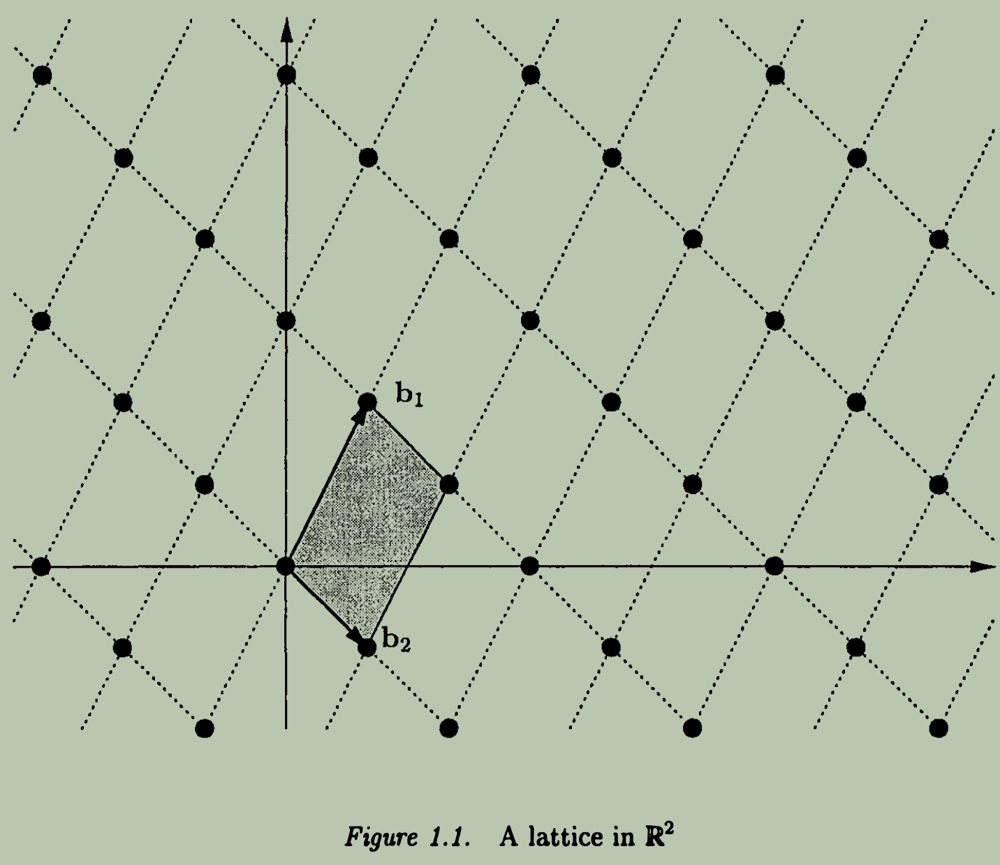
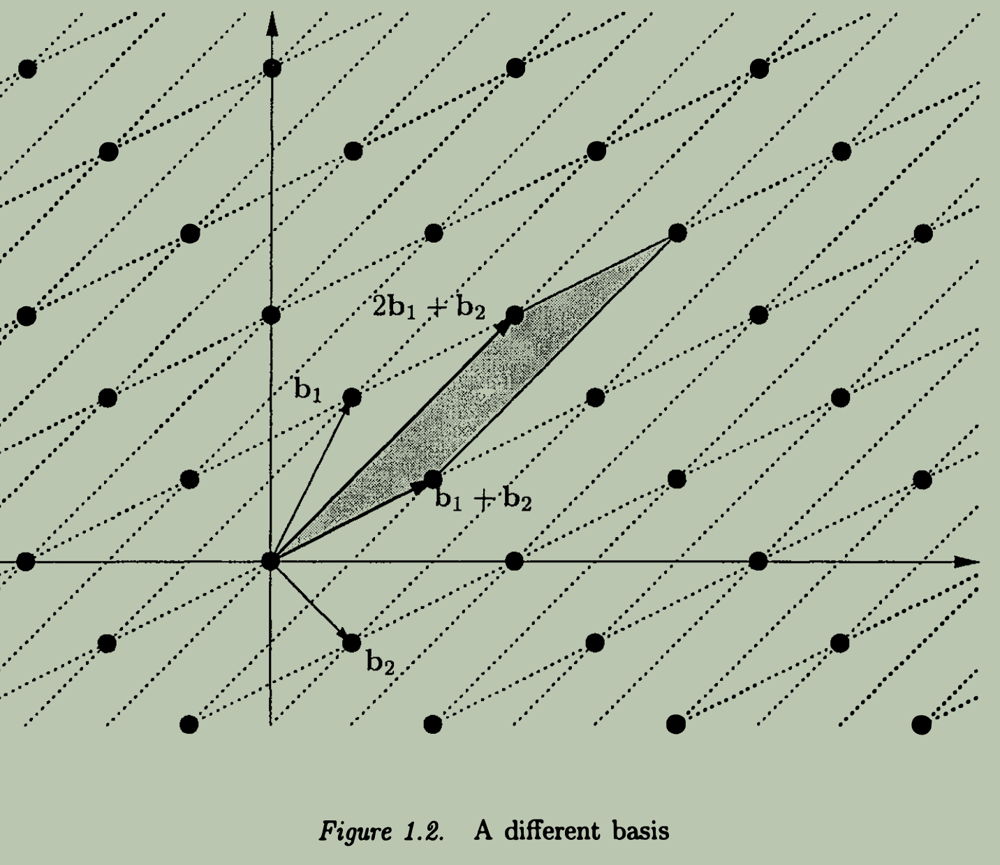
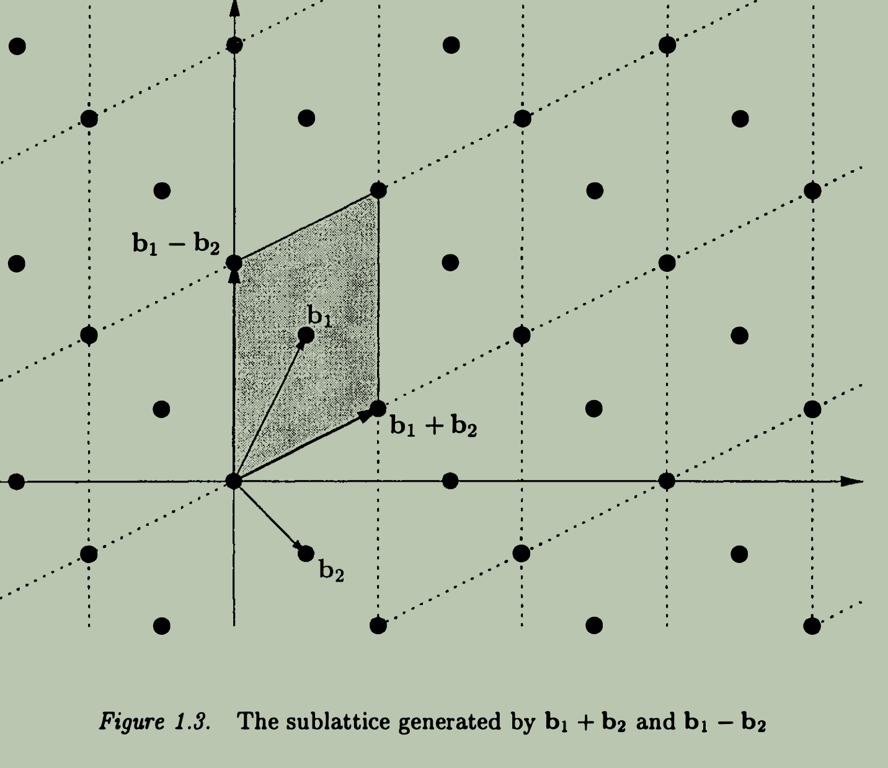
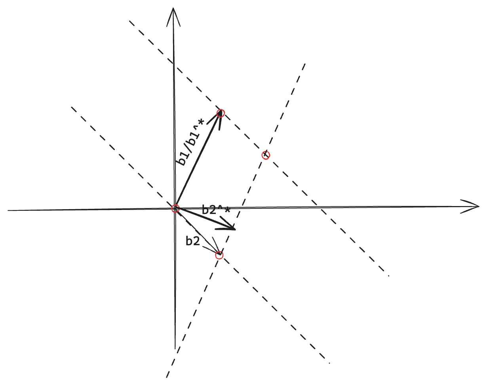
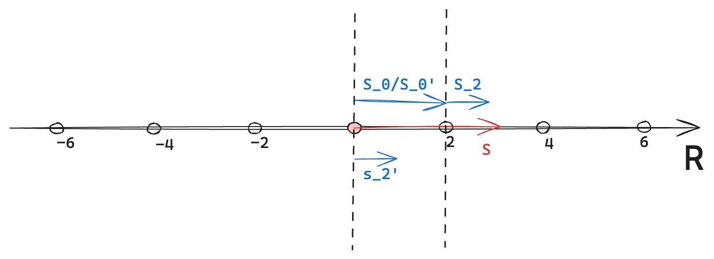

Table of Contents

- [Basics](#basics)
  - [Lattice](#lattice)
    - [Determinant](#determinant)
    - [Successive Minima](#successive-minima)
    - [Minkowski's Theorem](#minkowskis-theorem)
  - [Computational Problems](#computational-problems)
    - [Complexity Theory](#complexity-theory)
    - [Same Lattice Problems](#same-lattice-problems)
    - [Hardness of Approximation](#hardness-of-approximation)

 

In complexity theory, we say a problem is hard if it it hard for the worst-case instance; while in cryptography, a problem is deemed hard only if it is hard for the average-case instance (i.e., for all but a negligible fraction of instances).

# Basics

## Lattice 

**Definition of a Lattice**

Let $\mathbb{R}^m$ be the $m$-dimensional Euclidean (inner product) space. A lattice in $\mathbb{R}^m$ is the set 
$$
\mathcal{L}(b_1, ..., b_n) = \left\{ \sum_{i=1}^{n} z_i b_i \mid z_i \in \mathbb{Z} \right\}
$$
of all integer linear combinations of the basis vectors $b_1, ..., b_n$, where $n \le m$ is the rank of the lattice, and $m$ is the dimension of the lattice.

> [!Note] Domain of Lattice and Vector Space
> Note that the vector (Euclidean) space is defined over field $\mathbb{R}$, but the lattice itself is defined over the integers $\mathbb{Z}$. I think this is a fundamental difference between lattice and general subspace. Because lattice is **discrete**, it is only restricted to "integer span" of the basis vectors, whereas subspace is defined over the entire field $\mathbb{R}$ and can take arbitrary linear combinations of the basis vectors, which makes it **continuous**.

 

**Representation of a Lattice**

There are many different ways to represent a lattice, depending on the choice of basis vectors. For example, in 2-dimensional space $\mathbb{R}^2$, a lattice can have different bases that generate the same set of points. 

|               One Basis               |                  Another Basis                  |
| :-----------------------------------: | :---------------------------------------------: |
|  |  |

Where the left image shows a lattice generated by basis, 
$$
b_1 = \begin{pmatrix}1 \\ 2\end{pmatrix}, \quad b_2 = \begin{pmatrix}1 \\ -1\end{pmatrix}
$$
and the right image shows a lattice generated by another basis,
$$
b_1' = b_1 + b_2 = \begin{pmatrix}2 \\ 1\end{pmatrix}, \quad b_2' = 2b_1 + b_2 = \begin{pmatrix}3 \\ 3\end{pmatrix}
$$
We see that, the (intersection) points of the two lattices coincide, meaning that both bases generate the same set of lattice points in $\mathbb{R}^2$.

> [!Note] Why do different bases generate the same lattice?
> One question here : is there any relationships between these bases that generate the same lattice? The answer is yes, if they are related by a unimodular transformation, i.e., an integer matrix with determinant $\pm 1$. That is,
>$$
>B' = UB, \quad \text{where } U \in \mathbb{Z}^{n \times n} \text{ and } \det(U) = \pm 1.
>$$

----

 

We have already noticed that a lattice is defined over the integers $\mathbb{Z}$ which is **discrete**, whereas the Euclidean space is defined over the field $\mathbb{R}$ which is **continuous**. Recall that in linear algebra, the $\text{span}(B)$ is independent of the choice of basis $B$, meaning that any basis that generates the same subspace will have the same span. For lattices, different bases can also generate the same lattice. 

**Fact 1.1 - Span of Lattice Bases**

If $B$ and $B'$ generate the same lattice, then $\text{span}(B) = \text{span}(B')$.

Proof

To show $\text{span}(B) = \text{span}(B')$, we need to prove two inclusions:

1. $\text{span}(B') \subseteq \text{span}(B)$
2. $\text{span}(B) \subseteq \text{span}(B')$

---

Regarding (1), since $B' = B U$ where $U$ is invertible, basis $B'$ is a linear combination of the columns of $B$, meaning that any linear combination of the columns of $B'$ can also be expressed as a linear combination of the columns of $B$. Therefore, $\text{span}(B') \subseteq \text{span}(B)$.

Regarding (2), since $B = B' U^{-1}$ where $U$ is invertible, basis $B$ is a linear combination of the columns of $B'$, meaning that any linear combination of the columns of $B$ can also be expressed as a linear combination of the columns of $B'$. Therefore, $\text{span}(B) \subseteq \text{span}(B')$.

Completing the proof.

 

Clearly, we see :

1. In this case, lattice $\mathcal{L}(B)$ and vector space $\text{span}(B)$ are closely related, but they are not the same. The lattice consists of discrete points, while the vector space contains all linear combinations of the basis vectors with real coefficients .

2. Any set of $n$ linearly independent vectors from lattice $\mathcal{L}(B)$ forms a basis for vector space $\text{span}(B)$. But this set does not necessarily generate the entire lattice $\mathcal{L}(B)$.

    For example, two vectors from a lattice $\Lambda = \mathcal{L}(b_1, b_2)$,
    $$
    b_1' = b_1 + b_1 = [2, 1]^\top \\
    b_2' = b_1 - b_2 = [0, 3]^\top
    $$
    are independent, they are surely able to form a basis for vector space $\text{span}(b_1, b_2) = \mathcal{span}(\Lambda)$. But they cannot generate the lattice $\Lambda$ since $b_1 = \frac{1}{2} (b_1' + b_2')$, not an integer combination of $b_1'$ and $b_2'$.

> [!Note]
> So what is the characteristic of vectors that can form a lattice basis? How to remove the non-integer linear combinations from consideration?

**Fact 1.2 - Valid Lattice Basis**

Given a lattice $\mathcal{L}(B)$ with basis $B = [b_1, ..., b_n]$, and $n$ linearly independent lattice vectors, 
$$
B' = [b_1', ..., b_n'], b_i' \in \mathcal{L}(B)
$$
We define 
$$
\mathcal{P}(B') = \left\{ \sum_{i=1}^n x_i b_i' : 0 \leq x_i < 1 \right\}
$$
as the **half-open parallelepiped** generated by the basis $B'$. Note that the coefficients $x_i$ are restricted to the interval $[0, 1)$, which ensures that each point in $\mathcal{P}(B')$ is uniquely represented. Then $B'$ is a lattice basis if and only if $\mathcal{P}(B')$ does not contain any lattice vector (points) other than the zero vector (origin point).

 

> [!Note]
> If $B'$ is not a lattice basis for $\mathcal{L}(B)$, i.e., $\mathcal{L}(B') \ne \mathcal{L}(B)$. Since it is still linearly independent, so it also generates a lattice $\mathcal{L}(B')$ which is different from $\mathcal{L}(B)$. But, what is the relationship between $\mathcal{L}(B)$ and $\mathcal{L}(B')$?

**Fact 1.3 - Sublattice**

Sublattice is an natural concept after **half-open parallelepiped**, if there are lattice points from $\mathcal{L}(B)$ in the half-open parallelepiped, which implies a inclusion relationship : 
$$
\mathcal{L}(B') \subseteq \mathcal{L}(B).
$$
If $\mathcal{L}(B') \subsetneq \mathcal{L}(B)$, then we call $\mathcal{L}(B')$ a **proper sublattice** of $\mathcal{L}(B)$.

 

> [!Note]
> As we know the lattice basis vector is defined over $\mathbb{R}$. For the convenience of computation, we often consider lattice basis vectors over $\mathbb{Z}$, i.e., integer lattice basis vectors.

**Fact 1.4 - Lattice as a Subgroup**

It is obvious that a lattice $\mathcal{L}(B)$ has property of addition closure and contains the zero vector, i.e.,
$$
\mathbf{0} \in \mathcal{L}(B), \quad \text{and} \quad \forall u, v \in \mathcal{L}(B), \; u + v \in \mathcal{L}(B).
$$
Moreover, for any $u \in \mathcal{L}(B)$, its additive inverse $-u$ is also in $\mathcal{L}(B)$. Therefore, a lattice $\mathcal{L}(B)$ forms a subgroup of the additive group $(\mathbb{R}^n, +)$.

 

### Determinant

**Definition of Determinant of a Lattice**

The *determinant* of a lattice $\mathcal{L}(B)$, denoted as $\det(\mathcal{L}(B))$, geometrically is the volume of the fundamental parallelepiped generated by the basis $B$, i.e.,
$$
\det(\mathcal{L}(B)) = \text{Vol}(\mathcal{P}(B)).
$$
Furthermore, the determinant of a lattice is independent of the choice of basis. That is, if $B$ and $B'$ are two different bases of the same lattice $\mathcal{L}(B)$, $\mathcal{L}(B) = \mathcal{L}(B')$, then
$$
\det(\mathcal{L}(B)) = \det(\mathcal{L}(B')).
$$
Intuitively, the determinant is the shaded area of the fundamental parallelepiped generated by the basis $B$ shown in the figures above.

A natural question is how to compute the determinant of a lattice given one basis? There are two solutions for this.

**Gram-Schmidt Process**

The natural way is to :
1. compute the orthogonal basis $B^* = (b_1^*, ..., b_n^*)$ corresponding to the given basis $B = (b_1, ..., b_n)$ using the *Gram-Schmidt process*.
2. take the product of the norms of the orthogonal basis vectors to obtain the determinant:
    $$
    \det(\mathcal{L}(B)) = \prod_{i=1}^n \|b_i^*\|,
    $$
    where $b_i^*$ are the Gram-Schmidt orthogonalized vectors of the basis $B$.

Take the figure 1.1 as an example, after applying the Gram-Schmidt process to the basis vectors, we obtain :
$$
\begin{aligned}
b_1^* &= b_1 \\
b_2^* &= b_2 - \frac{\langle b_2, b_1^* \rangle}{\langle b_1^*, b_1^* \rangle} b_1^* \\
\end{aligned}
$$
where $\langle b_1^*, b_2^* \rangle = 0$. Even though the "shaded" area is a *parallelogram*, after being orthogonalized, it is a *rectangle* with area equal to the product of two orthogonal edges which corresponds to the product of the norms of the orthogonalized vectors.

----

> [!Note]
> By *Gram-Schmidt orthogonalization*, we can obtain a orthogonal basis $B^*$ from any given basis $B$, if $B$ is a lattice basis, i.e., $B \in \mathcal{L}(B)$. It is obvious that some orthogonal basis vector $b_i^*$ might not be in the lattice space anymore, i.e., $b^* \notin \mathcal{L}(B)$, since the coefficients $\frac{\langle b_i, b_j^* \rangle}{\langle b_j^*, b_j^* \rangle}$ might not be an integer.

We see that $B^* = (b_1^*, b_2^*)$ is not a lattice basis since one point from $\mathcal{L}(B)$ does lie in $\mathcal{L}(B^*)$, which implies that $\mathcal{L}(B^*) \ne \mathcal{L}(B)$.

 

**Determinant of Lattice Basis Matrix**

In linear algebra, we know that, if $B = (b_1, ..., b_n)$ is a basis of $\text{span}(B)$, then the determinant of the matrix formed by the basis vectors is equal to the product of the norms of the Gram-Schmidt orthogonalized vectors and a sign factor:
$$
\det (B) = (-1)^{\sigma}  \cdot \prod_{i=1}^n \|b_i^*\|
$$
If $B$ is a lattice basis, then the determinant of the lattice $\mathcal{L}(B)$ is equal to the absolute value of the determinant of the basis matrix:
$$
\det(\mathcal{L}(B)) = \prod_{i=1}^n \|b_i^*\| = |\det(B)| = \sqrt{B^T B}
$$
This is an alternative way to compute the determinant of a lattice given its basis, instead of computing every orthogonal vectors sequentially.

 

### Successive Minima

Let $\mathcal{L}(B)$ be a lattice generated by the basis $B$ with rank $n$. The $i$-th successive minimum $\lambda_i(\mathcal{L}(B))$ is defined as:
$$
\lambda_i(\mathcal{L}(B)) = \inf \{ r > 0 : \dim(\text{span}(\mathcal{L}(B) \cap B(0, r))) \ge i \}
$$
Intuitively, the $i$-th successive minimum represents the smallest radius of a ball centered at the origin that contains at least $i$ linearly independent lattice vectors.

More specially, when $i = 1$, the first successive minimum $\lambda_1(\mathcal{L}(B))$ corresponds to the length of the shortest non-zero lattice vector in $\mathcal{L}(B)$ :
$$
\lambda_1(\mathcal{L}(B)) = \min \{\|v\| : v \in \mathcal{L}(B) \setminus \{0\}\}
$$

> [!Note]
> The successive minima $\lambda_i(\mathcal{L}(B))$ is independent of the choice of the lattice basis $B$, but the orthogonal basis obtained from Gram-Schmidt orthogonalization does have a relationship with the first successive minimum $\lambda_1(\mathcal{L}(B))$.

 

**Fact 1.5 - First Successive Minimum as an Upper Norm Bound of Lattice Basis**

Let $B$ a lattice basis, and let $B^*$ be the corresponding Gram-Schmidt orthogonalized basis. Then, the first successive minimum $\lambda_1(\mathcal{L}(B))$ provides an upper bound for the norms of the vectors in $B^*$:
$$
\text{min}_j \|b_j^*\| \le \lambda_1(\mathcal{L}(B)), \quad \forall i = 1, ..., n
$$

Proof

For simplicity, we only consider a basis of a two-dimensional lattice, i.e., $B = (b_1, b_2)$. The Gram-Schmidt orthogonalized basis is $B^* = (b_1^*, b_2^*)$. By definition, we have:
$$
b_1^* = b_1, \quad b_2^* = b_2 - \frac{\langle b_2, b_1^* \rangle}{\|b_1^*\|^2} b_1^*
$$

---

Suppose any non-zero lattice vector $v = c_1 b_1 + c_2 b_2$ where $c_1, c_2 \in \mathbb{Z}$. Since $\text{span}(b_1^*, b_2^*) = \text{span}(b_1, b_2)$, any lattice vector can also be expressed as a linear combination of the Gram-Schmidt orthogonalized basis vectors:
$$
\begin{aligned}
v &= c_1 b_1^* + c_2 \cdot (b_2^* + \frac{\langle b_2, b_1^* \rangle}{\|b_1^*\|^2} b_1^*) \\
&= (c_1 + c_2 \frac{\langle b_2, b_1^* \rangle}{\|b_1^*\|^2}) b_1^* + c_2 b_2^*
\end{aligned}
$$

Two cases involved:

(a) If $c_2 \ne 0$, $v$'s component perpendicular to orthogonal basis vector $b_1^*$ is given by:
$$
v_{\perp b_1^*} = c_2 b_2^*
$$
thus we have $\| v \| \ge  \| v_{\perp b_1^*} \| = |c_2| \|b_2^*\| \ge \|b_2^*\|$. 

(b) If $c_2 = 0$, $v$ is parallel to $b_1^*$, thus we have $\| v \| \ge \| v_{\perp b_2^*} \| = |c_1| \|b_1^*\| \ge \|b_1^*\|$. 

This implies for any non-zero lattice vector $v$, we have:
$$
\| v \| \ge b_1^* \text{ or }  \| v \| \ge b_2^*
$$
which is equivalent with 
$$
\| v \| \ge \min_j \| b_j^* \| 
$$

----

More specially, for the first successive minimum $\lambda_1(\mathcal{L}(B))$ which is the smallest non-zero lattice vector norm, we have:
$$
\lambda_1(\mathcal{L}(B)) \ge \text{min}_j \| b_j^* \| 
$$

 

### Minkowski's Theorem

**Blichfeldt's Theorem**

Let $\Lambda$ be a lattice, and let $S \subset \text{span}(\Lambda)$ be a measurable set with volume $\text{vol}(S) > \det(\Lambda)$. Then, there exist two distinct points $x, y \in S$ such that $x - y \in \Lambda$.

Proof

Let $\Lambda = 2 \mathbb{Z}$ be the lattice of even integers on x-axis, and $\mathcal{P}(\Lambda) = [0, 2)$ is a fundamental parallelepiped of the lattice (with only one basis vector $2$). Consider a measurable set $S = [0, 3) \subseteq \text{span}(\Lambda) = \mathbb{R}$, which ensures $\text{vol}(S) = 3 > \det(\Lambda) = 2$, then we need to show that exists $x, y \in [0, 3)$ such that $x - y \in \Lambda$. 

---

Note that lattice $\Lambda$ is a set of discrete even points on x-axis, and $S$ is real interval on x-axis. A few facts on this : 

1. The entire vector space $\mathbb{R} = \text{span}(\Lambda)$ is partitioned into disjoint translates of the fundamental parallelepiped $\mathcal{P}(\Lambda)$, i.e., $\Lambda + \mathcal{P}(\Lambda) = \mathbb{R}$ :
    $$
    \begin{aligned}
      \mathbb{R} = \text{span}(\Lambda) &= \bigcup_{x \in \Lambda} (x + \mathcal{P}(\Lambda)) \\
      &= [0, 2) \cup [2, 4) \cup [4, 6) \cup \dots
    \end{aligned}
    $$

2. The projections on these disjoint translates of the fundamental parallelepiped cover the entire set $S$. That is, 
    $$
      S = \bigcup_{x \in \Lambda} \big( S \cap (x + \mathcal{P}(\Lambda)) \big)
    $$
    In our example, $S = S_0 + S_2 = [0, 2) + [2, 3)$.

3. $\text{vol}(S) > \det(\Lambda)$ ensures that there exist at least two points in $S$ that differ by a lattice vector, we can use the pigeonhole principle to guarantee this. In our example,   
   $$
   \text{vol}(S) = \text{vol}(S_0) + \text{vol}(S_2) = 2 + 1 = 3 > \det(\Lambda) = 2
   $$
   Therefore, there must exist two points $x \in S_0$ and $y \in S_2$ such that $x - y \in \Lambda$. For instance, $x = 0.5 \in S_0$ and $y = 2.5 \in S_2$, then $x - y = -2 \in \Lambda$.

 

## Computational Problems

### Complexity Theory

 

### Same Lattice Problems

 

### Hardness of Approximation

 