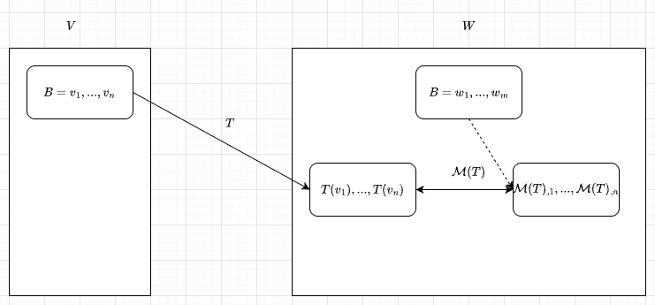
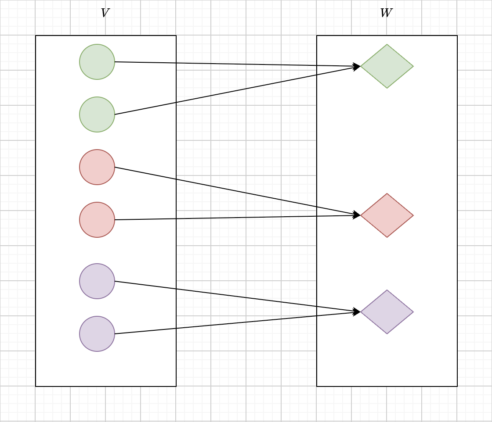

<strong>Table of Contents</strong> (click to expand)

- [Ch01 - Vector Spaces](#ch01---vector-spaces)
  - [Subspace](#subspace)
    - [Sum of Subspaces](#sum-of-subspaces)
    - [Direct Sums](#direct-sums)
- [Ch02 - Finite-Dimensional](#ch02---finite-dimensional)
  - [Span and Linear Independence](#span-and-linear-independence)
    - [Linear Combinations and Span](#linear-combinations-and-span)
    - [Linear independence](#linear-independence)
  - [Bases](#bases)
  - [Dimension](#dimension)
- [Ch03 - Linear Maps](#ch03---linear-maps)
  - [Vector Space of Linear Maps](#vector-space-of-linear-maps)
  - [Null Space and Ranges](#null-space-and-ranges)
  - [Matrices](#matrices)
    - [Matrix of a linear map](#matrix-of-a-linear-map)
    - [Column-row Factoring](#column-row-factoring)
  - [Invertibility and Isomorphisms](#invertibility-and-isomorphisms)
    - [Invertible Linear Maps](#invertible-linear-maps)
    - [Isomorphic Vector Spaces](#isomorphic-vector-spaces)
    - [Linear Map VS Matrix-vector Multiplication](#linear-map-vs-matrix-vector-multiplication)
    - [Change of Basis](#change-of-basis)
  - [Products and Quotients of Vector Spaces](#products-and-quotients-of-vector-spaces)
    - [Products of Vector Spaces](#products-of-vector-spaces)
    - [Quotient Spaces](#quotient-spaces)
  - [Duality](#duality)
    - [Dual Space and Dual Map](#dual-space-and-dual-map)
    - [Null Space and Range of Dual of Linear Map](#null-space-and-range-of-dual-of-linear-map)
    - [Matrix of Dual of Linear Map](#matrix-of-dual-of-linear-map)

 

# Ch01 - Vector Spaces

## Subspace

**Definition 1.0 - Subspace of Vector Space** {#definition-1-0 .definition-anchor}

A subspace $U$ of a vector space $V$ is a subset of $V$ that is itself a vector space under the same addition and scalar multiplication as $V$. Formally, it has two properties:
- additivity: for all $u_1, u_2 \in U$, we have $u_1 + u_2 \in U$.
- homogeneity: for all $u \in U$ and all scalars $\alpha$, we have $\alpha u \in U$.

These two properties are also the criteria for a subset of a vector space to be a subspace.

### Sum of Subspaces 

**Definition 1.1 - Sum of two subspaces** {#definition-1-1 .definition-anchor}

Given two subspaces $U$ and $V$ of some (any) vector space, their sum $U + V$ is defined as the set of all vectors that can be written as the sum of a vector from $U$ and a vector from $V$, that is
$$
U + V = \{ u + v \mid u \in U, v \in V \}.
$$

 

> [!Note] Analogous to The Union of Sets 
> Sum of subspaces $U$ and $V$ is the smallest subspace that contains both $U$ and $V$, which is analogous to the union of sets in set theory but within the context of vector spaces.

 

**Definition 1.2 - Sum of a family of subspaces** {#definition-1-2 .definition-anchor}

Given a family of subspaces $\{U_i\}$ of a vector space, their sum $\sum_i U_i$ is defined as the set of all vectors that can be written as the sum of vectors from each $U_i$, that is
$$
\sum_i U_i = \left\{ \sum_i u_i \mid u_i \in U_i \right\}.
$$

 

> [!Important] Uniqueness of Representation ?
> Is the representation of any element of sum of subspaces unique or not? In the following section we will focus on this question.

### Direct Sums

**Definition 1.3 - Direct sum of two subspaces** {#definition-1-3 .definition-anchor}

Given two subspaces $U$ and $V$ of a vector space, their direct sum $U \oplus V$ is defined as the set of all vectors that can be **uniquely** written as the sum of a vector from $U$ and a vector from $V$, that is
$$
U \oplus V = \{ u + v \mid u \in U, v \in V \text{ and this representation is unique} \}.
$$

 

**Definition 1.4 - Direct sum of a family subspaces** {#definition-1-4 .definition-anchor}

Given a family of subspaces $\{U_i\}$ of a vector space, their direct sum $\oplus_i U_i$ is defined as the set of all vectors that can be **uniquely** written as the sum of vectors from each $\{U_i\}$, that is
$$
\bigoplus_i U_i = \left\{ \sum_i u_i \mid u_i \in U_i \text{ and this representation is unique} \right\}.
$$

> [!Note] Direct Sum VS Sum
> Direct-sum is a stronger condition than the ordinary sum of subspaces, as it requires the representation of each vector as a sum of vectors from the subspaces to be **unique**.

So it seems that direct sum is more important than the ordinary sum of subspaces, as it provides a stronger **structural** property by ensuring uniqueness of representation. **Structural** or **structure** is a crucial concept in all algebraic contexts, including linear algebra for sure. We will explore this concept further in the subsequent sections.

 

> [!Important] Direct Sum Criterion ?
How can we determine if a given family of subspaces forms a direct sum? Do we have to check the uniqueness of the representation for every vector individually? We will see the answer in the following propositions.

 

**Lemma 1.1 - Criterion for Direct Sum of a Family of Subspaces:** {#lemma-1-1 .lemma-anchor}

The direct sum of a family of subspaces $\{U_i\}$ holds if and only if the only way to represent the zero vector as a sum of vectors from each $U_i$ is by taking all vectors to be zero.

<strong>Proof Logic </strong> (click to expand)

This is a $\textcolor{red}{iff}$ problem, meaning we need to show both directions:  
1. **If direction:** Assume the direct sum holds. Show that the only way to represent the zero vector as a sum of vectors from each $U_i$ is by taking all vectors to be zero.  
2. **Only if direction:** Assume the only way to represent the zero vector as a sum of vectors from each $U_i$ is by taking all vectors to be zero. Show that this implies the representation of any vector as a sum of vectors from each $U_i$ is unique.

Regarding the forward direction, it trivially holds $0 = 0 + ... + 0$ is unique representation of zero vector. 

Regarding the backward direction, suppose $v \in V$ has two representations  
$$
v = v_1 + ... + v_n = u_1 + ... + u_n
$$
, then we have
$$
0 = (v_1 - u_1) + ... + (v_n - u_n)
$$
By assumption $0 = 0 + ... + 0$, we have $v_i = u_i$ for all $i$, proving the uniqueness of direct sum.

 

**Lemma 1.2 - Criterion for Direct Sum of Two Subspaces:** {#lemma-1-2 .lemma-anchor}

The direct sum $U \oplus V$ holds if and only if the intersection of sets $U$ and $V$ is $\{0\}$.

$$
U \cap V = \{0\}.
$$

<strong>Proof Logic </strong> (click to expand)

This is also a $\textcolor{red}{iff}$ problem, meaning we need to show both directions:  
1. **If direction:** Assume $U \oplus V$ holds. Show that $U \cap V = \{0\}$.  
2. **Only if direction:** Assume $U \cap V = \{0\}$. Show that this implies the representation of any vector in $U + V$ as a sum of vectors from $U$ and $V$ is unique.

Regarding the forward direction, by $\textcolor{red}{contradiction}$ we suppose $U \cap V = \{0, x\}$ for some non-zero vector $x$, then element $x$ has at least two representations which is contradict with the uniqueness of the direct sum.

Regarding the backward direction, the proof is similar to that of Proposition 1.1.

 

> [!Important] Is Dimension Important ?
> The dimension of a vector space is a fundamental concept that measures the "size" of the space in terms of the number of vectors in a basis. It plays a crucial role in understanding the structure and properties of vector spaces. And we will mainly focus on finite-dimensional vector spaces which is more manageable and widely applicable in practice.

# Ch02 - Finite-Dimensional

## Span and Linear Independence

Span and linear independence is two fundamental concepts in linear algebra that help us understand the structure of vector spaces, especially the basis in finite-dimensional vector spaces.

### Linear Combinations and Span

Usually, the span of a set of vectors is the smallest subspace that contains all the vectors in the set. It captures all possible linear combinations of the vectors, providing a way to describe the subspace generated by them.

**Definition 2.1 - Span** {#definition-2-1 .definition-anchor}

The span of a set of vectors $S$ in a vector space $V$ is the set of all linear combinations of the vectors in $S$
$$
\text{span}(S) = \left\{ \sum_{v \in S} a_v v \mid a_v \in F \right\}.
$$

$\text{span}(S)$ is called the span space of $S$, it has the following properties:
1. $\text{span}(S)$ is a subspace of the vector space $V$.

    

    
<strong>Proof Logic </strong> (click to expand)

    By the subspace *definition 1.0*, we have to show that $\text{span}(S)$ satisfies additivity and homogeneity:

    a. **Additivity:** For any $u, v \in \text{span}(S)$, we have $u + v \in \text{span}(S)$. It follows from the fact that $u$ and $v$ are linear combinations of vectors in $S$, and the sum of two linear combinations is also a linear combination of vectors in $S$.

    b. **Homogeneity:** For any $u \in \text{span}(S)$ and any scalar $\alpha$, we have $\alpha u \in \text{span}(S)$. It follows from the fact that $u$ is a linear combination of vectors in $S$, and multiplying a linear combination by a scalar results in another linear combination of vectors in $S$.

    

2. $\text{span}(S)$ is the smallest subspace containing the set $S$ .
    

    
<strong>Proof Logic </strong> (click to expand)

    Let $W$ be any subspace of $V$ that contains $S$. We need to show that $\text{span}(S) \subseteq W$, which implies that any element from $\text{span}(S)$ is also in $W$.

    Since $W$ is a subspace containing $S$, it must be closed under linear combinations of vectors in $S$. Therefore, any linear combination of vectors in $S$ is also in $W$. By definition, $\text{span}(S)$ is the set of all linear combinations of vectors in $S$. Hence, $\text{span}(S) \subseteq W$.

    

 

> [!Important] How Large Can the Span Be?
> Span could be any subspace, but how large it can be reached? We will discuss it soon 

**Definition 2.2 - Span of Vector Space and Finite-Dimensionality** {#definition-2-2 .definition-anchor}

A vector space $V$ is said to be spanned by a set of vectors $S$ if every vector in $V$ can be written as a linear combination of the vectors in $S$
$$
V = \text{span}(S).
$$
If a vector space $V$ is spanned by a (finite) set of vectors $S$ in it, i.e., $V = \text{span}(S)$, then we say this vector space $V$ is finite-dimensional.

 

> [!Important] Uniqueness of Representation
> If a vector space is finite-dimensional $V = \text{span}(S)$, then is there a **unique** way to represent every vector in a vector space $V$ as a linear combination of a given set of vectors $S$? It depends on the choices of the set $S$, the number of sets $S$ satisfying finite-dimensionality could be multiple. In the following section, we will try to seek a set of vectors that provides a unique representation for every vector in the space.

### Linear independence

**Definition 2.3 - Linear Independence** {#definition-2-3 .definition-anchor}

A set of vectors $S$ in a vector space $V$ is said to be linearly independent if the only way to represent the zero vector as a linear combination of the vectors in $S$ is by taking all coefficients to be zero.
$$
\sum_{v \in S} a_v v = 0 \Leftrightarrow a_v = 0 \text{ for all } v \in S.
$$

 

**Definition 2.4 - Linear Dependence** {#definition-2-4 .definition-anchor}

A set of vectors $S$ in a vector space $V$ is said to be linearly dependent if it is not linearly independent, i.e., there exists a non-trivial linear combination of the vectors in $S$ that equals the zero vector.
$$
\sum_{v \in S} a_v v = 0 \text{ with some } a_v \neq 0.
$$

 

**Lemma 2.1 - Linear Dependence Lemma** {#lemma-2-1 .lemma-anchor}

Suppose $v_1, v_2, \ldots, v_m$ is a list of linearly dependent vectors in vector space $V$, then there exists a vector $v_k$ that can be written as a linear combination of the preceding vectors,
$$
v_k \in \text{span}\{v_1, v_2, \ldots, v_{k-1}\} \text{ for some } k \in \{1, 2, \ldots, m\}.
$$

**Lemma 2.2 - Equivalent Spanning Set** {#lemma-2-2 .lemma-anchor}

Upon Lemma 2.1, suppose $v_k$ is removed from the set $\{v_1, v_2, \ldots, v_m\}$, the remaining set still spans the same subspace as the original set. That is
$$
\text{span}\{v_1, v_2, \ldots, v_m\} = \text{span}\{v_1, v_2, \ldots, v_{k-1}, v_{k+1}, \ldots, v_m\}.
$$

Proof Logic 

Suppose $v_k$ can be written as a linear combination of the preceding vectors, i.e.,
$$
v_k = \sum_{i=1}^{k-1} a_i v_i.
$$
Then any linear combination of $v_1, v_2, \ldots, v_m$ can be rewritten as a linear combination of the remaining vectors after removing $v_k$. Hence, the span remains the same.

 

**Lemma 2.3 - Finite-dimensional Subspace** {#lemma-2-3 .lemma-anchor}

Every subspace of a finite-dimensional vector space is finite-dimensional.

Proof Logic 

By finite-dimensional definition 2.2, a vector space $V$ is finite-dimensional if it has a finite spanning set. Let $S = \{v_1, v_2, \ldots, v_n\}$ be a finite spanning set of $V$. Any subspace $U$ of $V$ is spanned by a subset of $S$, which is also finite. Hence, $U$ is finite-dimensional.

 

**Lemma 2.4 - Length of Linearly Independent Set** {#lemma-2-4 .lemma-anchor}

The length of a linearly independent set of vectors in a vector space $V$ cannot exceed the length of a spanning set of $V$.

Proof Logic 

Proof: TODO

 

> [!Important] Boundary of Linear Independence and Spanning Set
> By Lemma 2.4, we see that the length of linear independent set could be up to the length of a spanning set. By definition 2.2, we see that the length of spanning set of vector space could be up to the cardinality of vector sapce. So what is the boundary between them called? It is called a basis.

## Bases

**Definition 2.5 - Basis** {#definition-2-5 .definition-anchor}

A set of vectors $B$ in a vector space $V$ is called a basis of $V$ if $B$ is linearly independent and $V$ is spanned by $B$.
$$
V = \text{span}(B), \quad B \text{ is linearly independent}.
$$
It would be costly to check both linear independence and spanning property separately. The criterion below provides an equivalent and often more practical way to verify if a set is a basis.

 

**Lemma 2.5 - Basis Criterion** {#lemma-2-5 .lemma-anchor}

A set of vectors $B$ in a vector space $V$ is a basis of $V$ if and only if every vector in $V$ can be uniquely represented as a linear combination of the vectors in $B$,
$$
v = \sum_{b_i \in B} a_i \cdot b_i \quad \text{with unique coefficients } a_i \in \mathbb{F}.
$$
This lemma also confirms the **uniqueness** representation of any element from a span of vector space.

Proof Logic 

This is a $\textcolor{red}{iff}$ argument, then we need to prove both directions:

1. Assuming $B$ is a basis of $V$, then every vector in $V$ can be uniquely represented as a linear combination of the vectors in $B$.

   Since $B$ is a basis, by its definition 2.5, $B$ is linearly independent and spans $V$. The spanning property ensures that every vector in $V$ can be written as a linear combination of vectors in $B$. Suppose  
   $$
   v = \sum_{b_i \in B} a_i \cdot b_i = \sum_{b_i \in B} a_i' \cdot b_i
   $$
   for some $v \in V$ and coefficients $a_i, a_i' \in \mathbb{F}$. 
   $$
   \sum_{b_i \in B} (a_i - a_i') \cdot b_i = 0
   $$
   By the linear independence of $B$, we must have $a_i = a_i'$ for all $i$, ensuring the uniqueness of the representation.

2. Assuming every vector in $V$ can be uniquely represented as a linear combination of the vectors in $B$, then $B$ is a basis of $V$.

   The uniqueness of representation implies that $B$ is linearly independent. The fact that every vector in $V$ can be represented as a linear combination of vectors in $B$ implies that $B$ spans $V$. Therefore, $B$ is a basis of $V$.

 

**Lemma 2.6 - Spanning Set Contains a Basis** {#lemma-2-6 .lemma-anchor}

Every spanning set of a vector space $V$ contains a basis of $V$.

Proof Logic 
 

To prove this lemma, we start with a spanning set of $V$, by basis definition 2.5, it has two cases :
- If the set is already linearly independent, it is a basis. 
- If not, by lemma 2.4, we can remove vectors that are linear combinations of others without losing the spanning property. Repeating this process, we eventually obtain a linearly independent subset that still spans $V$, which is a basis.

 

**Lemma 2.7 - Existence of a Basis** {#lemma-2-7 .lemma-anchor}

Every finite-dimensional vector space $V$ has a basis.

Proof Logic 

By definition 2.3, a finite-dimensional vector space has a finite spanning set. By lemma 2.6, this spanning set contains a basis of $V$. Therefore, every finite-dimensional vector space has a basis.

 

**Lemma 2.8 - Extension of Linearly Independent Sets to a Basis** {#lemma-2-8 .lemma-anchor}

Every linearly independent set of vectors in a vector space $V$ can be extended to a basis of $V$.

Proof Logic 

Proof Logic:

Let $S$ be a linearly independent set of vectors in $V$, by basis definition 2.5, it has two cases :
- If $S$ already spans $V$, it is a basis. 
- If not, we can add vectors from $V$ that are not in the span of $S$ to $S$ while maintaining linear independence. Repeating this process, we eventually obtain a linearly independent set that spans $V$, which is a basis.

 

**Lemma 2.9 - Existence of Complementary Subspace** {#lemma-2-9 .lemma-anchor}

Every subspace of $V$ is part of a direct-sum equals $V$. That is, if $U$ is a subspace of $V$, then there exists a subspace $W$ of $V$ such that
$$
V = U \oplus W.
$$

Proof Logic 

Let $U$ be a subspace of $V$, subspace $U$ can be spitted into two cases :
- If $U = V$, then we can take $W = \{0\}$, so that $V = U \oplus W$.
- If not, suppose the basis of $U$ is $S$, since set $S$ is linearly independent, by lemma 2.8, it can be extended to a basis of $V$, assume the basis of $V$ is $S \cup T$. Let $W$ be the subspace spanned by $T$, and $T$ is also the basis of $W$ as all elements of $T$ are linearly independent. All elements of basis $S \cup T$ are linearly independent, so $U \cap W = \{0\}$, further more by lemma 1.2, direct sum $U \oplus W$ holds.

 

> [!Important] The Invariant of All Bases
> For a vector space $V$, there are many bases for it. But what is the common property (or invariant) of all bases? The interesting fact is that all bases of a vector space have the same number of elements. This number is called the dimension of $V$.

## Dimension

**Lemma 2.10 - Invariant of All Bases** {#lemma-2-10 .lemma-anchor}

Any two bases of a finite-dimensional vector space $V$ have the same number of elements.

Proof Logic 

Let $B_1$ and $B_2$ be two bases of a finite-dimensional vector space $V$. Since $B_1$ is a basis, it is linearly independent and spans $V$. Consider $B_1$ as a basis of subspace of $V$, by lemma 2.8, it can be extended to a basis of $V$. But $B_1$ is already a basis of $V$, so its cardinality cannot be increased. The same is true for $B_2$. Therefore, $B_1$ and $B_2$ must have the same number of elements.

 

**Definition 2.6 - Dimension** {#definition-2-6 .definition-anchor}

The dimension of a finite-dimensional vector space $V$ is the number of elements in any basis of $V$.
$$
\dim(V) = \text{number of elements in any basis of } V.
$$

 

**Lemma 2.11 - Dimension of Subspace** {#lemma-2-11 .lemma-anchor}

The dimension of a subspace $U$ of a finite-dimensional vector space $V$ satisfies
$$
\dim(U) \leq \dim(V).
$$

Proof Logic 

Let $U$ be a subspace of a finite-dimensional vector space $V$. Any basis of $U$ can be extended to a basis of $V$ by the lemma of linear independent set extension (lemma 2.8). Therefore, the number of elements in a basis of $U$ cannot exceed the number of elements in a basis of $V$, which implies
$$
\dim(U) \leq \dim(V).
$$

 

**Lemma 2.12 - Linearly Independent Set of Maximum Length** {#lemma-2-12 .lemma-anchor}

Every linearly independent set of vectors in a finite-dimensional vector space $V$ of length $\dim V$ is a basis of $V$.

Proof Logic 

By the lemma of extension of linear independent sets (lemma 2.8), any linearly independent set in a finite-dimensional vector space can be extended to a basis. Since the given set has length $\dim V$, it cannot be extended further, and thus it must already be a basis of $V$.

 

**Lemma 2.13 - Subspace of Maximum Dimension** {#lemma-2-13 .lemma-anchor}

A subspace of a finite-dimensional vector space $V$ of dimension $\dim V$ is equal to $V$.

Proof Logic 

Let $U$ be a subspace of a finite-dimensional vector space $V$ with $\dim(U) = \dim(V)$. By lemma of dimension of subspace (lemma 2.11), we have $\dim(U) \leq \dim(V)$. By the lemma of extension of linear independent sets (lemma 2.8), any basis of $U$ can be extended to a basis of $V$. Since $\dim(U) = \dim(V)$, the basis of $U$ already has the maximum possible length, and thus it must also be a basis of $V$. Therefore, $U = V$.

 

**Lemma 2.14 - Spanning Set of Maximum Length** {#lemma-2-14 .lemma-anchor}

A spanning set of a finite-dimensional vector space $V$ of length $\dim V$ is a basis of $V$.

Proof Logic 

Let $S$ be a spanning set of a finite-dimensional vector space $V$ with length $\dim V$. By the lemma of extension of linear independent sets (lemma 2.8), any linearly independent subset of $S$ can be extended to a basis of $V$. Since $S$ already has length $\dim V$, it must contain a linearly independent subset of the same length, which is a basis of $V$. Therefore, $S$ itself is a basis of $V$.

 

**Lemma 2.15 - Dimension of the Sum of Two Subspaces** {#lemma-2-15 .lemma-anchor}

If $V_1$ and $V_2$ are finite-dimensional vector spaces, then the dimension of their sum satisfies
$$
\dim(V_1 + V_2) = \dim(V_1) + \dim(V_2) - \dim(V_1 \cap V_2).
$$

Proof Logic 

Let $V_1$ and $V_2$ be finite-dimensional vector spaces. Consider the linear map $f : V_1 \times V_2 \to V_1 + V_2$ defined by $f(v_1, v_2) = v_1 + v_2$. The kernel of $f$ is $V_1 ∩ V_2$, and the image of $f$ is $V_1 + V_2$. By the rank-nullity theorem, we have
$$
\dim(V_1 \times V_2) = \dim(\ker(f)) + \dim(\text{im}(f)) = \dim(V_1 \cap V_2) + \dim(V_1 + V_2).
$$
Since $\dim(V_1 \times V_2) = \dim(V_1) + \dim(V_2)$, we obtain
$$
\dim(V_1) + \dim(V_2) = \dim(V_1 \cap V_2) + \dim(V_1 + V_2),
$$
which gives the desired result:
$$
\dim(V_1 + V_2) = \dim(V_1) + \dim(V_2) - \dim(V_1 \cap V_2).
$$

 

> [!Important] Actions on Vector Spaces
> For now we only discussed the object in linear algebra, vector space more specially finite-dimensional vector space, and its structure through bases and dimension. But we have not touched the function between vector spaces. The next natural step is to study the morphisms between vector spaces, which are the linear maps, and understand their properties and the vector space they form.

# Ch03 - Linear Maps

Linear maps themselves also form a vector space, we will call it vector space of linear maps. Specifically, if $V$ and $W$ are vector spaces over the same field $F$, then the set of all linear maps from $V$ to $W$, denoted by $\text{Hom}(V, W)$ or $\mathcal{L}(V, W)$, forms a vector space over $F$ with pointwise addition and scalar multiplication. In the following section we will discuss this topic in more detail.

## Vector Space of Linear Maps

**Definition 3.1 - Linear Map and Homomorphism** {#definition-3-1 .definition-anchor}

Linear map of vector spaces is a homomorphism from one vector space to another, preserving addition and multiplication by scalars, where both vector spaces are defined over the same field. More formally definition is :

A linear map (or linear transformation) $f$ from a vector space $V$ to a vector space $W$ over the same field $F$ is a function $f : V → W$ that satisfies
- Additivity 
    $$
    f(v_1 + v_2) = f(v_1) + f(v_2) \in W, \quad \forall v_1, v_2 \in V,
    $$
- Homogeneity 
    $$
    f(a \cdot v) = a \cdot f(v) \in W, \quad \forall a \in F, v \in V.
    $$
These two properties are also the criteria for determining a function to be a linear map.

 

> [!Important] How to Determine a Linear Map ?
> As we known from last section, a vector space is determined by its basis. Once given bases for both the domain and codomain vector spaces, a linear map is completely determined by its action on the basis vectors of the domain. Different actions (or functions) corresponds to different linear maps.

**Lemma 3.1 - Linear Map Determined by Basis** {#lemma-3-1 .lemma-anchor}

Suppose $v_1, ..., v_n$ is a basis of $V$ and $w_1, ..., w_n \in W$. Then there exists a unique linear map $f \in \mathcal{L}(V, W)$ such that $f(v_i) = w_i$ for all $i = 1, ..., n$.

Proof Logic

We have to show two things : 
1. the existence of a linear map $f \in \mathcal{L}(V, W)$ such that $f(v_i) = w_i$ for all $i = 1, ..., n$, 
2. the uniqueness of such a linear map.

Regarding aspect 1, it is a $\textcolor{red}{existence}$ statement, we need to $\textcolor{red}{find}$ a proper function of type $f : V \to W$ : 
$$
f (c_1 v_1 + ... + c_n v_n) = c_1 w_1 + ... + c_n w_n
$$
such that it implies $f(v_i) = w_i$ for all $i = 1, ..., n$. By the definition of linear map (definition 3.1), we need to show that this function satisfies the two properties of linear map: additivity and homogeneity. In this case, we can say that the function $f$ defined above is indeed a linear map from $V$ to $W$.

Regarding aspect 2, it is a $\textcolor{red}{uniqueness}$ statement. In general, two functions are $\textcolor{red}{equal}$ if and only if they agree on any element of the input domain.
So we need to show that if there exists another function $g : V \to W$ such that $g(v_i) = w_i$ for all $i = 1, ..., n$, then $g = f$. This can be done by noting that *any* vector $v \in V$ can be uniquely expressed as a linear combination of the basis vectors $v_1, ..., v_n$, and both $f$ and $g$ must map $v = c_1 v_1 + ... + c_n v_n$ to the same linear combination of $w_1, ..., w_n$.

 

**Definition 3.2 - Linear Maps as Vector Space** {#definition-3-2 .definition-anchor}

The set of all linear maps from a vector space $V$ to a vector space $W$ over the same field $F$, denoted by $\mathcal{L}(V, W)$, forms a vector space over $F$ with the following operations :

- **Additivity**: For $f, g \in \mathcal{L}(V, W)$, define $(f + g)(v) = f(v) + g(v) \in W$ for all $v \in V$, which means $f + g \in \mathcal{L}(V, W)$. 

- **Homogeneity**: For $a \in F$ and $f \in \mathcal{L}(V, W)$, define $(a \cdot f)(v) = a \cdot f(v) \in W$ for all $v \in V$, which means $a \cdot f \in \mathcal{L}(V, W)$. 

 

**Definition 3.3 - Composition of Linear Maps** {#definition-3-3 .definition-anchor}

The composition (or multiplication) of two linear maps $f : U \to V$ and $g : V \to W$ is the linear map $g \circ f : U \to W$ defined by $(g \circ f)(u) = g(f(u))$ for all $u \in U$. It has following properties :

- **Associativity**: For $f : U \to V$, $g : V \to W$, and $h : W \to X$ are linear maps, then $h \circ (g \circ f) = (h \circ g) \circ f$.

- **Identity**: For any vector space $V$, the identity map $\text{id}_V : V \to V$ defined by $\text{id}_V(v) = v$ for all $v \in V$ satisfies $\text{id}_V \circ f = f$ and $g \circ \text{id}_V = g$ for any linear maps $f : U \to V$ and $g : V \to W$.

- **Distributivity**: For linear maps $f, g : U \to V$ and $h : V \to W$, we have $h \circ (f + g) = h \circ f + h \circ g$.

Note that the composition of linear maps is not commutative in general, i.e., $g \circ f$ may not be equal to $f \circ g$.

 

> [!Important] Dive into Linear Map 
> For now, we only get to known the basic properties of (general) linear maps. In the following section, let us take a closer look at two special subspace under a linear map :
> 1.  null space (or kernel), the preimage in the domain of the zero vector under the linear map.
> 2.  range (or image), the set of all vectors in the codomain that are mapped from vectors in the domain under the linear map.
>
> where null space is usually closed related with injectivity property of the linear map, and range is usually closely related with surjectivity property of the linear map.

## Null Space and Ranges 

This section will explore some special linear maps.

**Definition 3.4 - Null Space** {#definition-3-4 .definition-anchor}

Let $f \in \mathcal{L}(V, W)$ be a linear map. The **null space** (or **kernel**) of $f$ is the set of all vectors in $V$ that are mapped to the zero vector in $W$, denoted by $\text{null}(f)$ or $\ker(f)$:
$$
\text{null}(f) = \ker(f) = \{ v \in V \mid f(v) = 0 \}.
$$

 

**Lemma 3.2 - Null Space As a Subspace** {#lemma-3-2 .lemma-anchor}

The null space of a linear map $f \in \mathcal{L}(V, W)$ is a subspace of $V$.

Proof Logic

To show a linear map is a subspace, by the definition of subspace (definition 1.1), we need to verify three conditions:

1. The existence of identity element: The zero vector $0 \in V$ is in the null space since $f(0) = 0$.

2. Additive closure: If $u, v \in \text{null}(f)$, then $f(u + v) = f(u) + f(v) = 0 + 0 = 0$, so $u + v \in \text{null}(f)$.

3. Scalar multiplication closure: If $v \in \text{null}(f)$ and $c \in F$, then $f(c \cdot v) = c \cdot f(v) = c \cdot 0 = 0$, so $c \cdot v \in \text{null}(f)$.

 

> [!Important] Special Null Space 
> In general, the null space could be any subspace of the domain. But what if the null space is a trivial subspace, i.e., $\{0\}$?

**Definition 3.5 - Injective** {#definition-3-5 .definition-anchor}

A function $f : V \to W$ is said to be injective (or one-to-one) if for all $u, v \in V$, $f(u) = f(v)$ implies $u = v$.

> [!Note]
> In general, the concept of injective is applied to all functions, not just linear maps.

 

**Lemma 3.3 - Criteria for Injective Linear Map** {#lemma-3-3 .lemma-anchor}

A linear map $f \in \mathcal{L}(V, W)$ is injective if and only if its null space is $\{0\}$.

Proof Logic

This is a iff $\iff$ statement, so we need to prove both directions:

- **If direction**: Assume $f$ is injective. Then for any $v \in V$, if $f(v) = 0$, we must have $v = 0$. Hence, the null space of $f$ is $\{0\}$.
- **Only if direction**: Assume the null space of $f$ is $\{0\}$. If $f(u) = f(v)$ for some $u, v \in V$, then $f(u) - f(v) = 0$, which implies $f(u - v) = 0$. Since the null space is $\{0\}$, we have $u - v = 0$, and thus $u = v$. Therefore, $f$ is injective.

 

**Definition 3.6 - Range** {#definition-3-6 .definition-anchor}

Let $f \in \mathcal{L}(V, W)$ be a linear map. The **range** (or **image**) of $f$ is the set of all vectors in $W$ that are mapped from vectors in $V$, denoted by $\text{range}(f)$ or $\text{im}(f)$:
$$
\text{range}(f) = \text{im}(f) = \{ w \in W \mid w = f(v) \text{ for some } v \in V \}.
$$

 

**Lemma 3.4 - Range as a Subspace** {#lemma-3-4 .lemma-anchor}

The range of a linear map $f \in \mathcal{L}(V, W)$ is a subspace of $W$.

Proof Logic

To show the range is a subspace, by the definition of subspace (definition 1.1), we need to verify three conditions:

1. The existence of identity element: The zero vector $0 \in W$ is in the range since $f(0) = 0$ as $0 \in V$.

2. Closed under addition: If $w_1, w_2 \in \text{range}(f)$, then $w_1 = f(v_1)$ and $w_2 = f(v_2)$ for some $v_1, v_2 \in V$. Hence, $w_1 + w_2 = f(v_1) + f(v_2) = f(v_1 + v_2) \in \text{range}(f)$ as $v_1 + v_2 \in V$.

3. Closed under scalar multiplication: If $w \in \text{range}(f)$ and $c \in F$, then $w = f(v)$ for some $v \in V$, and $c \cdot w = c \cdot f(v) = f(c \cdot v) \in \text{range}(f)$ as $c \cdot v \in V$.

 

**Definition 3.7 - Surjective Linear Map** {#definition-3-7 .definition-anchor}

A linear map $f \in \mathcal{L}(V, W)$ is said to be surjective (or onto) if its range is the entire codomain $W$, i.e., $\text{range}(f) = W$.*

 

**Linear Map Dimension Theorem** {#linear-map-dimension-theorem .theorem-anchor}

For any linear map $f \in \mathcal{L}(V, W)$, the dimension of the domain $V$ is equal to the sum of the dimensions of the null space and the range of $f$, that is,
$$
\dim V = \dim \text{null}(f) + \dim \text{range}(f).
$$

Proof Logic

The statement does not explicit show the dimensions of these three vector spaces, but we can assume that :

1. $u_1, u_2, \dots, u_m$ be a basis for $\text{null}(f)$, where $m = \dim \text{null}(f)$.

2. Since $u_1, ..., u_m$ are independent, we can extend this set to a basis for $V$ by incrementally adding independent vectors $v_1, v_2, \dots, v_n$ such that $u_1, ..., u_m , v_1, ..., v_n$ spans the entire space $V$, where $n = \dim V - m$. Thus, $\{u_1, \dots, u_m, v_1, \dots, v_n\}$ is a basis for $V$.

Now we only need to show that $\dim range(f) = n$, in other words, there $\color{red}{exists}$ a set of $n$ vectors in $\text{range}(f)$ that forms a basis for $\text{range}(f)$. So $\textcolor{red}{finding}$ a proper basis for $\text{range}(f)$ will complete the proof.

Considering the set $\{f(v_1), f(v_2), \dots, f(v_n)\}$. We claim that this set forms a basis for $\text{range}(f)$, by the definition of basis we need to show two things: spanning and linear independence :

1. **Spanning**: Any vector $w \in \text{range}(f)$ can be written as $w = f(v)$ for some $v \in V$. Since $\{u_1, \dots, u_m, v_1, \dots, v_n\}$ is a basis for $V$, we can write $v = a_1 u_1 + \dots + a_m u_m + b_1 v_1 + \dots + b_n v_n$. Applying $f$, we get $w = f(v) = a_1 f(u_1) + \dots + a_m f(u_m) + b_1 f(v_1) + \dots + b_n f(v_n)$. But $f(u_i) = 0$ for all $i$, so $w = b_1 f(v_1) + \dots + b_n f(v_n)$, showing that $\{f(v_1), \dots, f(v_n)\}$ spans $\text{range}(f)$.

2. **Linear independence**: Suppose $c_1 f(v_1) + \dots + c_n f(v_n) = 0$, we only need to show that $c_1 = \dots = c_n = 0$. Then $f(c_1 v_1 + \dots + c_n v_n) = 0$, which means $c_1 v_1 + \dots + c_n v_n \in \text{null}(f)$. Since $\{u_1, \dots, u_m, v_1, \dots, v_n\}$ is a basis for $V$, the vectors $v_1, \dots, v_n$ are independent of the null space basis vectors $u_1, \dots, u_m$. Therefore, $c_1 = \dots = c_n = 0$, proving linear independence.

Hence, $\{f(v_1), \dots, f(v_n)\}$ is a basis for $\text{range}(f)$, and $\dim \text{range}(f) = n$. This completes the proof.

 

**Lemma 3.5 - Not Injective Linear Map** {#lemma-3-5 .lemma-anchor}

Linear map to a lower-dimensional space is not injective.

Proof Logic

By $\text{injective} \iff \dim null(f) > 0$, so we only need to show that $\dim null(f) > 0$ for a linear map to a lower-dimensional space.

By the **Fundamental Theorem of Linear Maps**, we have
$$
\dim V = \dim \text{null}(f) + \dim \text{range}(f).
$$
If $f$ maps to a lower-dimensional space, then $\dim \text{range}(f) < \dim V$. Therefore,
$$
\dim \text{null}(f) = \dim V - \dim \text{range}(f) > 0,
$$
which shows that $\dim \text{null}(f) > 0$, proving that $f$ is not injective.

 

**Lemma 3.6 - Not Surjective Linear Map** {#lemma-3-6 .lemma-anchor}

Linear map to a higher-dimensional space is not surjective.

Proof Logic

By $\text{surjective} \iff \text{range}(f) = W$, again since $\text{range}(f)$ is a subspace of $W$, its dimension cannot exceed that of $W$, so we only need to show that $\dim \text{range}(f) < \dim W$ for a linear map to a higher-dimensional space.

By the **Fundamental Theorem of Linear Maps**, we have
$$
\dim V = \dim \text{null}(f) + \dim \text{range}(f).
$$
If $f$ maps to a higher-dimensional space, then $\dim W > \dim V \ge \dim \text{range}(f)$. Therefore,
$$
\dim \text{range}(f) < \dim W,
$$
which shows that $f$ is not surjective.

 

**Lemma 3.7 - Existence of Non-trivial Solution for Homogeneous System** {#lemma-3-7 .lemma-anchor}

A homogeneous system of linear equations with more variables than equations has a non-zero solution.

Mark that "homogeneous" means all the constant terms on the right-hand side of the equations are zero.

Proof Logic

Proof logic :  
Consider the linear map $f: \mathbb{F}^n \to \mathbb{F}^m$ corresponding to the homogeneous system of linear equations, where $n$ is the number of variables and $m$ is the number of equations. Since $n > m$, we have $\dim \mathbb{F}^n = n > m \ge \dim \text{range}(f)$. By the **Fundamental Theorem of Linear Maps**, 
$$
\dim \mathbb{F}^n = \dim \text{null}(f) + \dim \text{range}(f),
$$
which implies $\dim \text{null}(f) = n - \dim \text{range}(f) > 0$. Therefore, there exists a non-zero vector in the null space of $f$, which corresponds to a non-zero solution of the homogeneous system.

 

**Lemma 3.8 - No Non-trivial Solution for Homogeneous System** {#lemma-3-8 .lemma-anchor}

A system of linear equations with more equations than variables has no non-zero solution.

Proof Logic

By $\text{Surjective} \iff \text{range}(f) = W$, that is 
$$
\forall y \in \text{range}(f), \exists x \in \mathbb{F}^n \text{ such that } f(x) = y.
$$

By the $\textcolor{red}{contrapositve}$ way, if $f$ is not surjective, then :
$$
\exists y \notin \text{range}(f), \forall x \in \mathbb{F}^n, f(x) \neq y.
$$
So original problem "A system of linear equations with more equations than variables has no non-zero solution" can be reduced to "$f$ is not surjective", which means $\dim \text{range}(f) < \dim W = m$. 

By the **Fundamental Theorem of Linear Maps**, we have
$$
\dim V = \dim \text{null}(f) + \dim \text{range}(f),
$$
which implies $\dim \text{range}(f) = \dim V - \dim \text{null}(f) \le \dim V = n$, by assumption $n < m$, we have $\dim \text{range}(f) < \dim W = m$, proved the the non-surjective of $f$. Therefore, the homogeneous system has no non-zero solution.

 

> [!Important] Representation of Linear Map
> As we know, linear maps themself forms a vector space. Before we dive into its structure, we need a representation for it, matrix is a proper representation.

## Matrices

### Matrix of a linear map

**Definition 3.8: Matrix of a Linear Map** {#definition-3-8 .definition-anchor}

Given a linear map $T: \mathcal{L}(V, W)$ and bases $\{v_1, \dots, v_n\}$ for $V$ and $\{w_1, \dots, w_m\}$ for $W$, the matrix of $T$ with respect to these bases is a $m \times n$ matrix $A$ whose $(i,j)$-th entry $A_{ij}$ is defined by
$$
T(v_j) = \sum_{i=1}^m A_{ij} w_i.
$$
where the $j$-th column $A_{.,j}$ of $A$ corresponds to the coordinates of $T(v_j)$ with respect to the basis $\{w_1, \dots, w_m\}$ of $W$. Formally, we call the matrix of a specific linear map $T$ with respect to the bases $\{v_1, \dots, v_n\}$ and $\{w_1, \dots, w_m\}$ as $\mathcal{M}(T)$.

 

**Definition 3.9 : $\mathbb{F}^{m, n}$** {#definition-3-9 .definition-anchor}

$\mathbb{F}^{m, n}$ means the set of all $m \times n$ matrices with entries from the field $\mathbb{F}$. It also represents the vector space of linear maps from $\mathbb{F}^n$ to $\mathbb{F}^m$.

Specially, matrix $A$ can be regarded as a linear map $T$ that maps any standard basis vectors of $\mathbb{F}^n$ to the coordinates of their images under $T$ in the basis $\{w_1, \dots, w_m\}$ of $W$. For example, let $T \in \mathcal{L}(\mathbb{F}^2, \mathbb{F}^3)$ is defined by
$$
T(x, y) = (x + 3y, 2x + 5y, 7x + 9y)
$$
Then $T(1, 0) = (1, 2, 7)$ and $T(0, 1) = (3, 5, 9)$. Therefore, the matrix of $T$ with respect to the standard basis of $\mathbb{F}^2$ (i.e. $\{(1,0), (0,1)\}$) and standard basis of $\mathbb{F}^3$ (i.e. $\{(1,0,0), (0,1,0), (0,0,1)\}$) is
$$
\mathcal{M}(T) = 
\begin{bmatrix}
1 & 3 \\
2 & 5 \\
7 & 9
\end{bmatrix}
$$

 

**Lemma 3.9 : Dimension of \mathbb{F}^{m, n}** {#lemma-3-9 .lemma-anchor}

$\dim \mathbb{F}^{m, n} = mn$.

 

> [!Note] Why Choose Matrix Representation ?
> As we know, composition of linear maps is also a linear map, also a vector space. So it is natural to ask how the matrix of the composition relates to the matrices of the individual linear maps.

**Definition 3.10: Matrix of the Composition of Linear Maps** {#definition-3-10 .definition-anchor}

The matrix of the composition of two linear maps $f \in \mathcal{L}(U, V)$ and $g \in \mathcal{L}(V, W)$ with respect to bases $\{u_1, \dots, u_p\}$ for $U$, $\{v_1, \dots, v_n\}$ for $V$, and $\{w_1, \dots, w_m\}$ for $W$ is the product of the matrices of $f$ and $g$ with respect to these bases, that is ,
$$
\mathcal{M}(g \circ f) = \mathcal{M}(g) \cdot \mathcal{M}(f).
$$

 

**Lemma 3.10 : Matrix Multiplication** {#lemma-3-10 .lemma-anchor}

Matrix multiplication as linear combination of column or rows. Given $C$ is a $m \times c$ matrix and $R$ is a $c \times n$ matrix. That is :

-  The $k$-th column of $CR$ is a linear combination of the columns of $C$ with coefficients from the $k$-th column of $R$.

-  The $k$-th row of $CR$ is a linear combination of the rows of $R$ with coefficients from the $k$-th row of $C$.

 

### Column-row Factoring 

**Definition 3.11 : Column and Row Rank** {#definition-3-11 .definition-anchor}

Given $A$ is an $m \times n$ matrix, the column rank of $A$ is the dimension of the span of the columns of $A$ in $\mathbb{F}^{m, 1}$. The row rank of $A$ is the dimension of the span of the rows of $A$ in $\mathbb{F}^{1, n}$.

 

**Lemma 3.11 : Upper Bound for Column and Row Rank** {#lemma-3-11 .lemma-anchor}

The column rank and the row rank are at most $min(m, n)$.

Proof

Take column rank of $A$ :

- By the lemma of length of linear independent set, the dimension of the vector space of $span(\text{columns of } A)$ is at most $n$, we have the column rank of $A$ is at most $n$. 

- And the vector space of $span(\text{columns of } A)$ is a subspace of $\mathbb{F}^{m}$, by the lemma of dimension of subspace, so the dimension of it cannot exceed $\dim \mathbb{F}^{m} = m$. 

- Therefore the dimension of the span of the columns of $A$ is at most $min(m, n)$. 

Similarly, the row rank of $A$ is also at most $\min(m, n)$. Therefore, the column rank and the row rank are at most $\min(m, n)$.

 

**Lemma 3.12 : Matrix Column-row Factorization** {#lemma-3-12 .lemma-anchor}

Any $m \times n$ matrix $A$ of rank $r$ can be factored as $A = C R$, where $C$ is an $m \times r$ matrix, and $R$ is an $r \times n$ matrix.

Proof

Assume the column rank of $A$ is $r \le min(m, n)$. Then the columns of $A$ can be reduced to a basis of span the columns of $A$ with length $r$. So every element including all columnns of $A$ can be represented as a linear combination of these $r$ basis columns which represented as matrix $C$. The $k$-th column of $R$ is the coordinate of $k$-th column $A$ with respect to this basis matrix $C$. Similarly, the row-wise can also be proved.

 

**Lemma 3.13 : Rank of Matrix** {#lemma-3-13 .lemma-anchor}

Column rank equals row rank.

Proof

In general, the $\textcolor{red}{equivalence}$ problem of $a = b$ can be reduced to a pair of $\textcolor{red}{less-symmetric}$ problem: 
1. $a \le b$, 
2. $b \le a$ 

In this case, we need to show:
1. The column rank of $A$ is at most the row rank of $A$.
2. The row rank of $A$ is at most the column rank of $A$.

Regarding the second point, the rows of $R$ spans the rows of $A$, so the dimension of span space of rows of $A$ is at most the number of $R$ rows, which equals the column rank of $A$.

Regarding the first point, 
$$
\text{column rank of } A = \text{row rank of } A^t
\le \text{column rank of } A^t
= \text{row rank of } A
$$

 

> [!Important] Structure of A Linear Map
> By far, we know that :
>
> 1. Composition of a matrix can also be represented as a matrix
>
> 2. A matrix can be factored into a product of two matrices
> 
> A natural question arises : Can a linear map be decomposed ? The central topic of a linear map of two vector spaces is **structure**.

## Invertibility and Isomorphisms

In this section, we will focus on more special linear maps.

### Invertible Linear Maps

**Definition 3.12 : Invertible Linear Map** {#definition-3-12 .definition-anchor}

A linear map $T \in \mathcal{L}(V, W)$ is called invertible if there exists a linear map $S \in \mathcal{L}(W, V)$ such that $S \circ T = \text{id}_V$ and $T \circ S = \text{id}_W$.

 

**Lemma 3.14 : Uniqueness of Invertible Linear Map** {#lemma-3-14 .lemma-anchor}

If a linear map $T \in \mathcal{L}(V, W)$ is invertible, then its inverse $S \in \mathcal{L}(W, V)$ is also unique.

Proof

This is a $\textcolor{red}{uniqueness}$ argument, the solution to this is to suppose there are two inverses $S_1$ and $S_2$ of $T$, then show that $S_1 = S_2$.
1. both $S_1$ and $S_2$ are inverses of $T$, i.e.,
    $$
        S_1 \circ T = \text{id}_V, \quad T \circ S_1 = \text{id}_W \\
        S_2 \circ T = \text{id}_V, \quad T \circ S_2 = \text{id}_W
    $$
2. introducing multiplication by identity, then apply hypothese in 1)
    $$
    S_1 = S_1 \circ \text{id}_W = S_1 \circ (T \circ S_2) = (S_1 \circ T) \circ S_2 = \text{id}_V \circ S_2 = S_2
    $$
Hence, the inverse of $T$ is unique.

 

> [!Note]
> By definition of invertibility, a linear map is invertible if and only if it has a two-sided inverse. Finding such a matrix is hard, actually we have better criteria using injectivity and surjectivity.

**Lemma 3.15 : Criteria of Linear Map Invertibility** {#lemma-3-15 .lemma-anchor}

A linear map is invertible if and only if it is both injective and surjective.

Proof

Firstly, it is a $\textcolor{red}{iff}$ (biconditional) argument, so we need to prove both directions:
1. Forward direction, if a linear map is invertible, then it is both injective and surjective.
2. Backward direction, if a linear map is both injective and surjective, then it is invertible.

More in-depth, let $T \in \mathcal{L}(V, W)$ be an invertible linear map, regarding the forward direction:
1. Injectivity. Injectivity of linear map $T$ means  
    $$
        T(v_1) = T(v_2) \implies v_1 = v_2 \quad \forall v_1, v_2 \in V.
    $$
    Since $T$ is invertible, there exists $S \in \mathcal{L}(W, V)$ such that $S \circ T = \text{id}_V$. Applying $S$ to both sides of $T(v_1) = T(v_2)$ gives 
    $$
        S(T(v_1)) = S(T(v_2)) \implies \text{id}_V(v_1) = \text{id}_V(v_2) \implies v_1 = v_2.
    $$
    Hence, $T$ is injective.
2. Surjective. Surjectivity of linear map $T$ means 
    $$
        \forall w \in W, \exists v \in V \text{ such that } T(v) = w.
    $$
    Since $T$ is invertible, there exists $S \in \mathcal{L}(W, V)$ such that $S \circ T = \text{id}_V$ and $T \circ S = \text{id}_W$. For any $w \in W$, let $v = S(w) \in V$. Then 
    $$
        T(v) = T(S(w)) = (T \circ S)(w) = \text{id}_W(w) = w.
    $$
    Hence, $T$ is surjective.

Regarding the backward direction : 
1. Since $T$ is injective, for any $v_1, v_2 \in V$, $T(v_1) = T(v_2) \implies v_1 = v_2$. 
2. Since $T$ is surjective, for any $w \in W$, there exists $v \in V$ such that $T(v) = w$. 
3. Define a function (or map) $S : W \to V$ by assigning $S(w) = v$, where $v$ is the unique element in $V$ such that $T(v) = w$. The uniqueness of $v$ is guaranteed by the injectivity of $T$. In order to prove $S$ is the inverse of $T$, we need to show that :
    - 3.1. $S \circ T = \text{id}_V$
    - 3.2. $T \circ S = \text{id}_W$
    - 3.3. $S$ is a well-defined linear map of type $W \to V$, that is :
       - a. additivity: $S(w_1 + w_2) = S(w_1) + S(w_2) \quad \forall w_1, w_2 \in W$
       - b. homogeneity: $S(\alpha w) = \alpha S(w) \quad \forall w \in W, \forall \alpha \in \mathbb{F}$

We omit the detailed proof here.

 

**Lemma 3.16 : Invertible Linear Map Along Same Dimension** {#lemma-3-16 .lemma-anchor}

If both $V$ and $W$ are finite-dimensional vector spaces of the same dimension, then a linear map $T \in \mathcal{L}(V, W)$ is invertible if and only if it is either injective or surjective. That is
$$
T \text{ is invertible } \iff T \text{ is injective } \iff T \text{ is surjective }, \text{ when } \dim V = \dim W
$$

Proof

We have shown that 
$$
T \text{ is invertible } \iff T \text{ is both injective and surjective }.
$$
so we only need to show that 
$$
T \text{ is injective } \iff T \text{ is surjective }
$$

By the fundamental theorem of linear maps :
$$
\dim V = \dim \text{null } T + \dim \text{range } T
$$
- For the forward direction (injective implies surjective), assume $T$ is injective. Then $\dim \text{null } T = 0$, so 
    $$
        \dim V = 0 + \dim \text{range } T \implies \dim \text{range } T = \dim V.
    $$
  Since $\dim V = \dim W$, we have $\dim \text{range } T = \dim W$, which implies $T$ is surjective.
- For the backward direction (surjective implies injective), assume $T$ is surjective. Then $\dim \text{range } T = \dim W = \dim V$, so 
    $$
        \dim V = \dim \text{null } T + \dim \text{range } T = \dim \text{null } T + \dim V \implies \dim \text{null } T = 0.
    $$
  Hence, $T$ is injective.

 

**Lemma 3.17 : Cyclic Property of Invertible Linear Map Along Same Dimension** {#lemma-3-17 .lemma-anchor}

*Proposition : If $V$ and $W$ are finite-dimensional vector spaces of the same dimension, let $T \in \mathcal{L}(V, W)$, $S \in \mathcal{L}(W, V)$  be two linear maps. Then $S \circ T = \text{id}_V$ if and only if $T \circ S = \text{id}_W$.*

Proof

Intuitively $S \circ T = \text{id}_V$ and $T \circ S = \text{id}_W$ has no direct connection. However, it would be different if $T$ is invertible, because in that case $S = T^{-1}$ and the two conditions are equivalent. So we need to show that $T$ is indeed invertible under the given conditions.

As we have shown that invertibility of linear map is equivalent with being injective or surjective for finite-dimensional vector spaces of the same dimension, it suffices to show that $T$ is either injective or surjective under the given conditions. Let us take the injective, $T$ is injective means $\ker T = \{0\}$.

For any $v \in V$, such that $T(v) = 0$, then
$$
v = \text{id}_V (v) = (S \circ T)(v) = S(T(v)) = S(0) = 0.
$$
Hence, $\ker T = \{0\}$, which shows that $T$ is injective, further invertible, and the forward direction is established.

Similarly with the backward direction, we omit the detailed proof here.

 

> [!Important]
> We have a special name for the relationship between vector spaces in lemma 3.17 : **isomorphism**.

### Isomorphic Vector Spaces

**Definition 3.13 : Isomorphic Vector Spaces** {#definition-3-13 .definition-anchor}

Two vector spaces $V$ and $W$ are said to be isomorphic, denoted by $V \cong W$, if there **exists** an invertible linear map $T \in \mathcal{L}(V, W)$.

> [!Note]
> Isomorphism of two vector spaces does not require that every linear map between them are invertible.

 

> [!Important] Determine The Isomorphism
> **The topic of whether two objects have the same structure is central of abtract algebra, and isomorphisms provide a precise way to capture this notion.** In the case of isomorphism of vector spaces, it preserves the operations of vector addition and scalar multiplication on both directions. Is there an efficient way to determine if two vector spaces are structurally the same (or equivalent)?

 

**Lemma 3.18 : Criteria for Vector Space Isomorphism** {#lemma-3-18 .lemma-anchor}

Two finite-dimensional vector spaces $V$ and $W$ are isomorphic if and only if $\dim V = \dim W$.

Proof

This is an $\textcolor{red}{\text{iff}}$ problem, so we need to prove both directions.

- Forward direction ($\Rightarrow$): Assume $V \cong W$. Then there exists an invertible linear map $T \in \mathcal{L}(V, W)$. Since $T$ is invertible, it is both injective and surjective. By the rank-nullity theorem, $\dim V = \dim W$.

- Backward direction ($\Leftarrow$): Assume $\dim V = \dim W$. Since $\text{invertible} \iff \text{bijective}$, so we only need to show that there $\textcolor{red}{\text{exists}}$ a linear map $T$ that is bijective. Let $\{v_1, \dots, v_n\}$ be a basis of $V$ and $\{w_1, \dots, w_n\}$ be a basis of $W$. Then we $\textcolor{red}{\text{define}}$ a linear map $T \in \mathcal{L}(V, W)$ by : 
    $$
        T (c_1 v_1 + \dots + c_n v_n) = c_1 w_1 + \dots + c_n w_n
    $$
    we see that $\text{span}(w_1, \dots, w_n) = W \le \text{range}(T)$. Therefore, $T$ is surjective. Since $\dim V = \dim W$, by the rank-nullity theorem, $T$ is also injective. Hence, $T$ is bijective, and thus invertible. This completes the proof of the backward direction.

 

> [!Note] Linear Map of Vector Space of Linear Maps
> 1. We know that $\mathcal{L}(V, W)$ is a vector space of linear maps from $V$ to $W$, and if $T \in \mathcal{L}(V, W)$, then we have $\mathcal{M}(T) \in \mathbb{F}^{n, m}$, where $\mathcal{M}(T)$ denotes the matrix representation of $T$ with respect to chosen bases of $V$ and $W$.
>
> 2. Therefore, we can treat $\mathcal{M}$ as a linear map from the vector space $\mathcal{L}(V, W)$ to the vector space $\mathbb{F}^{n, m}$, that is ,
> $$
>     \mathcal{M} : \mathcal{L}(V, W) \to \mathbb{F}^{n, m}, \quad T \mapsto \mathcal{M}(T)
> $$    

**Lemma 3.19 - Linear Map of Vector Space of Linear Maps** {#lemma-3-19 .lemma-anchor}

$\mathcal{L}(V, W) \cong \mathbb{F}^{n, m}$.

Proof

Define a function $\mathcal{M} : \mathcal{L}(V, W) \to \mathbb{F}^{n, m}$ by $\mathcal{M}(T) \in \mathbb{F}^{n, m}$ the matrix representation of linear map $T \in \mathcal{L}(V, W)$ with respect to the chosen bases of $V$ and $W$. We need to show that $\mathcal{M}$ is a linear map and bijective, which would establish the isomorphism.
- Linearity (additivity and homogeneity): For any $T_1, T_2 \in \mathcal{L}(V, W)$ and scalar $c \in \mathbb{F}$, by the linearity of the matrix representation $\mathbb{F}^{n, m}$, we have
    $$
        \mathcal{M}(T_1 + T_2) = \mathcal{M}(T_1) + \mathcal{M}(T_2), \quad \mathcal{M}(c T_1) = c \mathcal{M}(T_1).
    $$
    Hence, $\mathcal{M}$ is linear.
- Bijectivity: 
    - Injectivity: If $\mathcal{M}(T) = 0$, then $T$ maps all basis vectors of $V$ to $0$ in $W$, which implies $T = 0$. Hence, $\mathcal{M}$ is injective.
    - Surjectivity: For any matrix $A \in \mathbb{F}^{n, m}$, we can define a linear map $T \in \mathcal{L}(V, W)$ such that $\mathcal{M}(T) = A$. Hence, $\mathcal{M}$ is surjective.

Therefore, $\mathcal{M}$ is a linear bijection, establishing the isomorphism between $\mathcal{L}(V, W)$ and $\mathbb{F}^{n, m}$.

 

**Lemma 3.20 - Dimension of Vector Space of Linear Maps** {#lemma-3-20 .lemma-anchor}

The dimension of the vector space $\mathcal{L}(V, W)$ is equal to the product of the dimensions of $V$ and $W$, i.e., $\dim \mathcal{L}(V, W) = (\dim V) * (\dim W)$.

Proof

By Lemma 3.19, we have an isomorphism $\mathcal{L}(V, W) \cong \mathbb{F}^{n, m}$. Therefore, the dimension of $\mathcal{L}(V, W)$ is equal to the dimension of $\mathbb{F}^{n, m}$, which is $n * m$, where $n = \dim V$ and $m = \dim W$. Hence,
$$
    \dim \mathcal{L}(V, W) = n * m = (\dim V) * (\dim W).
$$

### Linear Map VS Matrix-vector Multiplication

**Definition 3.14 - Matrix of Vector** {#definition-3-14 .definition-anchor}

Recalling that matrix of linear map $T \in \mathcal{L}(V, W)$ is defined as $\mathcal{M}(T)$. Let $v_1, \dots, v_m$ be the basis vectors of $V$ and $w_1, \dots, w_n$ be the basis vectors of $W$. 

Define $\mathcal{M}_W$ as the matrix representation of vectors in $W$ with respect to the chosen basis of $W$. By definition 3.8, the columns of matrix of linear map $T$ consists of matrix of the images of the basis vectors of $V$ under $T$, i.e.:
$$
  \mathcal{M}(T)_{., j} = \mathcal{M}_W(T(v_j))
$$
Similarly $\mathcal{M}_V$ is the matrix representation of vectors in $V$ with respect to the chosen basis of $V$. 

 

**Lemma 3.21 - Linear Maps Act Like Matrix Multiplication** {#lemma-3-21 .lemma-anchor}

Let $T \in \mathcal{L}(V, W)$ and $v \in V$. Then the matrix representation of $T(v)$ with respect to the chosen basis of $W$ is given by the product of the matrix representation of $T$ and the matrix representation of $v$ with respect to the chosen basis of $V$, i.e.:
$$
    \mathcal{M}_W(T(v)) = \mathcal{M}(T) \cdot \mathcal{M}_V(v).
$$

Proof Logic 

Suppose $v_1, \dots, v_m$ are the basis vectors of $V$ and $v \in V$ can be expressed as a linear combination of these basis vectors:
$$
    v = \sum_{j=1}^{m} \alpha_j v_j,
$$
where $\alpha_j \in \mathbb{F}$. By linearity of $T$, we have
$$
    T(v) = T\left(\sum_{j=1}^{m} \alpha_j v_j\right) = \sum_{j=1}^{m} \alpha_j T(v_j).
$$
Taking the matrix representation with respect to the chosen basis of $W$, we get:
$$
    \mathcal{M}_W(T(v)) = \sum_{j=1}^{m} \alpha_j \mathcal{M}_W(T(v_j)) = \sum_{j=1}^{m} \alpha_j \mathcal{M}(T)_{., j}.
$$
On the other hand, the matrix representation of $v$ with respect to the chosen basis of $V$ is:
$$
    \mathcal{M}_V(v) = \begin{bmatrix} \alpha_1 \\ \vdots \\ \alpha_m \end{bmatrix}.
$$
Therefore,
$$
    \mathcal{M}(T) \cdot \mathcal{M}_V(v) = \sum_{j=1}^{m} \alpha_j \mathcal{M}(T)_{., j} = \mathcal{M}_W(T(v)),
$$
which completes the proof.

> [!Important] The Role of Matrix of Linear Map
> As we know, linear map $T$ acts the transformation that maps $v$ in $V$ to $T(v)$ in $W$. We see that $\mathcal{M}_W(T(v))$ is the coordinate of image of $v$ under $T$ in $W$, and $\mathcal{M}_V(v)$ is the coordinate of $v$ in $V$. Then $\mathcal{M}(T)$ acts as the transformation matrix that maps the coordinates of $v$ in $V$ to the coordinates of $T(v)$ in $W$.
> 
> We can compare linear map $T$ with its matrix representation, but what is the relationship between them?

 

**Lemma 3.22 - Relation Between Linear Map and Its Matrix Representation** {#lemma-3-22 .lemma-anchor}

Let $T \in \mathcal{L}(V, W)$ be a linear map of two vector spaces $V$ and $W$ which are finite-dimensional. Then the dimension of $\text{range}(T)$ equals the column rank of $\mathcal{M}(T)$. 

Proof Logic 

Let $v_1, \dots, v_n$ be a basis of $V$, and $w_1, \dots, w_m$ be a basis of $W$. As we know,  
$$
    \text{range}(T) = \text{span}\{T(v_1), \dots, T(v_n)\},
$$
so by the linearity of the matrix representation $\mathcal{M}_W$, we have
$$
\begin{aligned}
    \mathcal{M}_W(\text{range}(T)) &= \mathcal{M}_W(\text{span}\{T(v_1), \dots, T(v_n)\}) \\
    &= \text{span}\{\mathcal{M}_W(T(v_1)), \dots, \mathcal{M}_W(T(v_n))\} \\
    &= \text{span}\{\mathcal{M}(T)_{., 1}, \dots, \mathcal{M}(T)_{., n}\} 
\end{aligned}
$$
which implies there exists an isomorphism : 
$$
    \text{range}(T) \cong \text{span}\{\mathcal{M}(T)_{., 1}, \dots, \mathcal{M}(T)_{., n}\}
$$
. Therefore, although $\text{range}(T) \subseteq W$ and $\text{span}(\mathcal{M}(T)_{.,1}, \dots, \mathcal{M}(T)_{., n}) \subseteq \mathbb{F}^{m, 1}$ belong to two different vector spaces, they are isomorphic via the matrix representation $\mathcal{M}_W$. That is why we can not directly compare them (e.g. $\le$, $\ge$, or any other comparators), but we can compare their structures through the isomorphism. This is also the key difference between $\cong$ and $=$.

By lemma 3.18, if two vector spaces are isomorphic, then they have the same dimension. Therefore, we have :
$$
    \dim \text{range}(T) = \dim \text{span}\{\mathcal{M}(T)_{., 1}, \dots, \mathcal{M}(T)_{., m}\} = \text{column rank of } \mathcal{M}(T)
$$

### Change of Basis

In this section, we will focus on another special linear map which maps a vector space to itself, we call it **linear operator**. Since matrix of linear map is boudled with bases of the domain and codomain, so when talking about the matrix of a linear operator, we always need to specify the bases of the vector spaces.

 

**Definition 3.15 - Invertible of Matrix** {#definition-3-15 .definition-anchor}

A square matrix $A \in \mathbb{F}^{n \times n}$ is said to be **invertible** if there exists a matrix $B \in \mathbb{F}^{n \times n}$ such that
$$
    AB = BA = I_n,
$$
where $I_n$ is the $n \times n$ identity matrix. In this case, the matrix $B$ is called the **inverse** of $A$, and is denoted by $A^{-1}$. Invertible and non-invertible are also called **nonsingular** and **singular**, respectively.

 

**Definition 3.16 - Matrix of Product of Linear Maps** {#definition-3-16 .definition-anchor}

Let $T_1 \in \mathcal{L}(U, V)$ and $T_2 \in \mathcal{L}(V, W)$ be two linear maps of finite-dimensional vector spaces $U$, $V$, and $W$. Let $u_1, \dots, u_p$ be a basis of $U$, $v_1, \dots, v_n$ be a basis of $V$, and $w_1, \dots, w_m$ be a basis of $W$. Then the matrix representation of the product of these two linear maps with respect to these bases is given by
$$
    \mathcal{M}(T_2 \circ T_1) = \mathcal{M}(T_2) \mathcal{M}(T_1),
$$
where $\mathcal{M}(T_1)$ is the matrix representation of $T_1$ with respect to the bases of $U$ and $V$, $\mathcal{M}(T_2)$ is the matrix representation of $T_2$ with respect to the bases of $V$ and $W$, and $\mathcal{M}(T_2 \circ T_1)$ is the matrix representation of the composition $T_2 \circ T_1$ with respect to the bases of $U$ and $W$.

 

**Definition 3.17 - Identity Operator** {#definition-3-17 .definition-anchor}

Let $V$ be a vector space over the field $\mathbb{F}$. The **identity operator** on $V$ is a special linear operator defined by    
$$
    I_V(v) = v \quad \text{for all } v \in V.
$$
More specifically, $I_V \in \mathcal{L}(V)$.

> [!Warning] Identity Operator VS Identity Matrix
> $I_V$ maps $v \in V$ to itself, so we can say $I_V$ itself is the identity matrix, i.e. $I_V = \text{diag}(1, \dots, 1)$. But we cannot say the matrix of identity operator $I_V$ is the identity matrix, since $\mathcal{M}$ dependens on the choice of bases for the domain and codomain :
>     
> 1. The matrix of identity operator $\mathcal{M}(I_V)$ with the same basis for both the domain and codomain is the identity matrix.
> 
> 2. The matrix of identity operator $\mathcal{M}(I_V)$ with two bases is a change-of-basis matrix with respect to the chosen bases.

 

**Lemma 3.23 - Matrix of Identity Operator with Two Bases** {#lemma-3-23 .lemma-anchor} 

Suppose that $u_1, ..., u_n$ and $v_1, ..., v_n$ are two bases of the vector space $V$. Then the matrices of identity operator $I_V$ with respect to these two different bases are  
$$
\mathcal{M}(I_V, (u_1, ..., u_n), (v_1, ..., v_n))
$$
and 
$$
\mathcal{M}(I_V, (v_1, ..., v_n), (u_1, ..., u_n))
$$
are inverses of each other. 

Proof

Since $I_V \circ I_V$ is an identity operator on $V$ with respect to the same basis, so its matrix is an identity matrix, i.e. $\mathcal{M}(I_V \circ I_V) = \text{diag}(1, \dots, 1)$. By definition 3.16, we have
$$
\mathcal{M}(I_V, (u_1, ..., u_n), (v_1, ..., v_n)) = \text{diag}(1, \dots, 1) = \mathcal{M}(I_V, (u_1, ..., u_n), (v_1, ..., v_n)) \mathcal{M}(I_V, (v_1, ..., v_n), (u_1, ..., u_n))
$$
and 
$$
\mathcal{M}(I_V, (v_1, ..., v_n), (u_1, ..., u_n)) = \text{diag}(1, \dots, 1) = \mathcal{M}(I_V, (v_1, ..., v_n), (u_1, ..., u_n)) \mathcal{M}(I_V, (u_1, ..., u_n), (v_1, ..., v_n)).
$$
Hence, the two matrices are inverses of each other.

 

**Lemma 3.24 - Change-of-basis Formula** {#lemma-3-24 .lemma-anchor}

Suppose that $T \in \mathcal{L}(V)$ is a linear operator on $V$, and $u_1, ..., u_n$ and $v_1, ..., v_n$ are two bases of the vector space $V$. Let 
$$
A = \mathcal{M}(T, (v_1, ..., v_n)),
B = \mathcal{M}(T, (u_1, ..., u_n)),
$$
be two matrices of the linear operator $T$ with respect to these two different bases, and $C = \mathcal{M}(I_V, (u_1, ..., u_n), (v_1, ..., v_n))$ be the change-of-basis matrix from the basis $(u_1, ..., u_n)$ to the basis $(v_1, ..., v_n)$. Then
$$
B = C^{-1} A C.
$$

Proof Logic

By definition 3.16, we have :
$$
\begin{aligned}
C B &= \mathcal{M}(I_V, (u_1, ..., u_n), (v_1, ..., v_n)) \mathcal{M}(T, (u_1, ..., u_n)) \\
&= \mathcal{M}(I_V \circ T, (u_1, ..., u_n), (v_1, ..., v_n)) \\
&= \mathcal{M}(T, (u_1, ..., u_n), (v_1, ..., v_n)) \\
\end{aligned}
$$
and
$$
\begin{aligned}
A C &= \mathcal{M}(T, (v_1, ..., v_n)) \mathcal{M}(I_V, (u_1, ..., u_n), (v_1, ..., v_n)) \\
&= \mathcal{M}(T \circ I_V, (u_1, ..., u_n), (v_1, ..., v_n)) \\
&= \mathcal{M}(T, (u_1, ..., u_n), (v_1, ..., v_n)) \\
\end{aligned}
$$
So we have $C B = A C$, by lemma 3.23, the matrix of identity operator with respect to two different bases is invertible, we have $B = C^{-1} A C$.

 

**Lemma 3.25 - Matrix of Inverse of a Linear Operator** {#lemma-3-25 .lemma-anchor}

Suppose that $v_1, ..., v_n$ is a basis of the vector space $V$, and $T \in \mathcal{L}(V)$ is an invertible linear operator on $V$. Let 
$$
A = \mathcal{M}(T, (v_1, ..., v_n)),
$$
be the matrix of the linear operator $T$ with respect to the basis $(v_1, ..., v_n)$. Then the matrix of the inverse operator $T^{-1}$ with respect to the same basis is given by
$$
\mathcal{M}(T^{-1}, (v_1, ..., v_n)) = A^{-1}.
$$

Proof

By definition 3.16, we have :
$$
\mathcal{M}(T^{-1} \circ T, (v_1, ..., v_n)) = \mathcal{M}(T, (v_1, ..., v_n)) \mathcal{M}(T^{-1}, (v_1, ..., v_n))
$$
Since $T^{-1} \circ T = I_V$, we have
$$
\mathcal{M}(I_V, (v_1, ..., v_n)) = I_n
$$
where $I_n$ is the $n \times n$ diagonal identity matrix. Therefore, we have
$$
\mathcal{M}(T, (v_1, ..., v_n)) \mathcal{M}(T^{-1}, (v_1, ..., v_n)) = I_n,
$$
which implies that
$$
\mathcal{M}(T^{-1}, (v_1, ..., v_n)) = \mathcal{M}(T, (v_1, ..., v_n))^{-1} = A^{-1}.
$$

 

## Products and Quotients of Vector Spaces

For now, we have only discussed vector space with one entry per vector. Next, we will consider vector spaces where each element is a tuple with multiple entries, leading to the concept of product of vector spaces. And later, we will also explore quotient spaces, which involve partitioning a vector space by a subspace, resulting each element is a coset of subspace. These two special vector spaces will be more structural.

### Products of Vector Spaces

**Definition 3.18 - Product of Vector Spaces** {#definition-3-18 .definition-anchor}

The product of the vector spaces $V_1, ..., V_m$ is the set of all ordered $m$-tuples $(v_1, ..., v_m)$ where $v_i \in V_i$ for each $i = 1, ..., m$. Formally,
$$
V_1 \times ... \times V_m = \{(v_1, ..., v_m) \mid v_i \in V_i \text{ for each } i = 1, ..., m\}.
$$

 

> [!Note] Product VS Sum
> Recalling that the sum of the subspaces $V_1, ..., V_m \subseteq V$ is defined as
> $$
> V_1 + ... + V_m = \{v_1 + ... + v_m \mid v_i \in V_i \text{ for each } i = 1, ..., m\},
> $$
> It is the smallest subspace of $V$ that contains all the subspaces $V_1, ..., V_m$.
> 
> While in product of vector spaces, we do not require that all $V_i$ are subspace of a common vector space; they can be arbitrary vector spaces. And the product $V_1 \times ... \times V_m$ itself forms a tuple vector space with component-wise addition and scalar multiplication.

**Lemma 3.26 - Product of Vector Spaces is a Vector Space** {#lemma-3-26 .lemma-anchor}

Suppose $V_1, ..., V_m$ are vector spaces over the same field $F$. Then the product $V_1 \times ... \times V_m$ is also a vector space over field $F$. 

 

**Lemma 3.27 - Dimension of Product of Vector Spaces** {#lemma-3-27 .lemma-anchor}

Suppose $V_1, ..., V_m$ are finite-dimensional vector spaces over the same field $F$. Then the dimension of the product $V_1 \times ... \times V_m$ is given by
$$
\dim(V_1 \times ... \times V_m) = \dim(V_1) + ... + \dim(V_m).
$$

Proof

By the linearity of product of vector spaces, for each entry-$i$ of its tuple, in order to span the entire vector space $V_i$, we need at least $\dim(V_i)$ independent vectors from $V_i$. Therefore, the total number of independent vectors required to span the product space $V_1 \times ... \times V_m$ is
$$
\dim(V_1) + ... + \dim(V_m),
$$
which proves that
$$
\dim(V_1 \times ... \times V_m) = \dim(V_1) + ... + \dim(V_m).
$$

 

**Lemma 3.28 - Product VS Direct Sum** {#lemma-3-28 .lemma-anchor}

Suppose $V_1, ..., V_m$ are subspaces of a vector space $V$. Define a linear map 
$$
\Gamma : V_1 \times ... \times V_m \to V_1 + ... + V_m
$$
by 
$$
\Gamma(v_1, ..., v_m) = v_1 + ... + v_m.
$$
where $v_i \in V_i$ for each $i = 1, ..., m$. Then $V_1 + ... + V_m$ is a direct sum if and only if $\Gamma$ is injective.

Proof

This is a $\textcolor{red}{\text{iff}}$ statement, meaning we need to prove both directions:

1. Forward direction ($\Rightarrow$) Suppose $V_1 + ... + V_m$ is a direct sum. By the lemma on direct sums, if $v_1 + ... + v_m = 0$ with $v_i \in V_i$, then $v_i = 0$ for all $i$. Then by definition of $\Gamma$, if $\Gamma(v_1, ..., v_m) = v_1 + ... + v_m = 0$, then $(v_1, ..., v_m) = (0, ..., 0)$, which shows that $\Gamma$ is injective.

2. Backward direction ($\Leftarrow$) Suppose $\Gamma$ is injective. The only solution for $\Gamma(v_1, ..., v_m) = 0$ is $(0,..., 0)$ where $v_i \in V_i$ for each $i = 1, ..., m$, which implies that the only solution for $v_1 + ... + v_m = 0$ is $(0, ..., 0)$. By the lemma on direct sum, it shows that $V_1 + ... + V_m$ is a direct sum.

 

**Lemma 3.29 - Dimension of Direct Sum** {#lemma-3-29 .lemma-anchor}

Suppose $V_1, ..., V_m$ are subspaces of a vector space $V$. Then $V_1 + ... + V_m$ is a direct sum if and only if 
$$
\dim(V_1 \oplus ... \oplus V_m) = \dim(V_1) + ... + \dim(V_m).
$$

Proof

By the definition of $\Gamma$ in lemma 3.28, we see that linear map $\Gamma$ is also surjective. Therefore $\dim \text{range}(\Gamma) = \dim (V_1 + ... + V_m)$. Since $Gamma$ is also surjective, by the linear map dimension lemma, we have :
$$ 
\dim(V_1 \times ... \times V_m) = \dim \ker(\Gamma) + \dim \text{range}(\Gamma) = \dim (V_1 + ... + V_m).
$$
By the lemma 3.27 on the dimension of the product of vector spaces, we have 
$$
\dim(V_1 \times ... \times V_m) = \dim(V_1) + ... + \dim(V_m).
$$
Therefore,
$$
\dim(V_1) + ... + \dim(V_m) = \dim (V_1 + ... + V_m),
$$
which completes the proof.

 

> [!Important] Addition Out of Subspace
> By the addition closure property of subspace, $u_1 + u_2 \in U \subseteq V$ for any $u_1, u_2 \in U$, but what if we want to add a vector $v \in V$ that is not necessarily in $U$? This leads to the concept of cosets and quotient spaces.

### Quotient Spaces 

**Definitinon 3.19 - Quotient Space** {#definition-3-30 .definition-anchor}

Suppose $V$ is a vector space and $U$ is a subspace of $V$. For any vector $v \in V$, the set
$$
v + U = \{v + u \mid u \in U\}
$$
is called the **coset** of $U$ containing $v$. In linear algebra we do not call it **coset** of $U$, we call it **translate** of $U$. In this case, the quotient space $V/U$ is defined as the set of all such translates:
$$
V/U = \{v + U \mid v \in V\}.
$$

And the operations of translates are defined as follows:
$$
\begin{aligned}
 (v + U) + (w + U) &= (v + w) + U \\
 \lambda (v + U) &= (\lambda v) + U.
\end{aligned}
$$

 

**Lemma 3.30 - Equality of Translates** {#lemma-3-30 .lemma-anchor}

Suppose $v, w \in V$, and $U \subseteq V$. Then we have the following equivalence:
$$
v - w \in U \iff v + U = w + U \iff (v + U) \cap (w + U) \neq \emptyset
$$

 

**Lemma 3.31 - Quotient Space as a Vector Space** {#lemma-3-31 .lemma-anchor}

Suppose $V$ is a vector space and $U$ is a subspace of $V$. Then the quotient space $V/U$ with the operations defined above is also a vector space.

 

> [!Note]
> By Lemma 3.30, two vectors in $V$ belong to the same translate of $U$, in quotient space $V/U$, they are the same element. Therefore, there must exists a well-defined mapping from vectors in $V$ to elements in $V/U$.

**Definition 3.20 - Quotient Map** {#definition-3-20 .definition-anchor}

Suppose $V$ is a vector space and $U$ is a subspace of $V$. The **natural projection** (or canonical projection) from $V$ to the quotient space $V/U$ is the linear map
$$
\pi: V \to V/U, \quad \pi(v) = v + U.
$$
Quotient map $\pi$ is also called **canonical projection**.

 

**Definition 3.21 - Dimension of Quotient Space** {#definition-3-21 .definition-anchor}

Suppose $V$ is a vector space and $U$ is a subspace of $V$. The **dimension** of the quotient space $V/U$ is defined as
$$
\dim(V/U) = \dim(V) - \dim(U).
$$

Proof

Since $U \subseteq V$, we have $u + U \in U$ for any $u \in U$, whhich implies $U = \ker(\pi)$. By definition 3.20, we see that quotient map $\pi$ is surjective, $\text{range}(\pi) = V/U$. By the rank-nullity theorem, we have
$$
\dim(V) = \dim(\ker(\pi)) + \dim(\text{range}(\pi)) = \dim(U) + \dim(V/U),
$$
which completes the proof.

 

> [!Important] First Thoughts On Vector Space Structure
> If there is a linear map $T : V \to W$ that sends elements of $V$ to elements of $W$ in a structural way shown in the diagram above, then there exists a unique linear map $\widetilde{T}$ making the diagram commute.

**Definition 3.22 - Linear Map $\widetilde{T}$** {#definition-3-22 .definition-anchor}

Suppose we have a linear map $T : V \to W$ and a quotient map $\pi : V \to V/U$ where $U = \ker(T)$. The linear map $\widetilde{T} : V/U \to W$ is defined 
$$
\widetilde{T}(v + U) = T(v)
$$
such that the following diagram commutes:
$$
\begin{aligned}
    &V \xrightarrow{T} W \\
    &\downarrow \pi \\
    &V/U
\end{aligned}
$$

 

**Lemma 3.32 - Properties of $\widetilde{T}$** {#lemma-3-32 .lemma-anchor}

Suppose $T \in \mathcal{L}(V, W)$. Then

a. $\widetilde{T} \circ \pi = T$, where $\pi$ is the quotient map of $V$ onto $V/\ker(T)$.

b. $\widetilde{T}$ is injective.

c. $\text{range}{\widetilde{T}} = \text{range}(T)$

d. $V/(\ker(T)) \cong \text{range}(T)$

Proof

Regarding (a), by definition of linear maps $\pi$ and $\widetilde{T}$, we have
$$
(\widetilde{T} \circ \pi) (v) = \widetilde{T}(\pi(v)) = \widetilde{T}(v + \ker(T)) = T(v),
$$
which shows that $\widetilde{T} \circ \pi = T$.

Regarding (b), by definition 
$$
\widetilde{T}(v + \ker(T)) = T(v) = 0
$$
we have $v = \ker(T)$, then $v + \ker(T) = \ker(T)$ corresponds the zero element in $V/\ker(T)$. This shows that $\widetilde{T}$ is injective.

Regarding (c), since $\pi$ is surjective and $\widetilde{T} \circ \pi = T$, we have $\text{range}(\widetilde{T}) = \text{range}(T)$.

Regarding (d), by lemma 3.18, we only need to show $\dim (V/\ker(T)) = \dim(\text{range}(T))$. By (b), (c) and nullity-rank theorem, we have
$$
\dim(V/\ker(T)) = \dim(\ker(\widetilde{T})) + \dim(\text{range}(\widetilde{T})) = 0 + \dim(\text{range}(T)),
$$
which completes the proof of (d).

 

## Duality

As we know, linear map itself is a vector space. In this section, we will discuss a special kind of vector space called the dual space and the associated dual maps.

### Dual Space and Dual Map

**Definition 3.23 - Dual Space** {#definition-3-23 .definition-anchor}

A linear function (or linear functional) $f$ on a vector space $V$ is a linear map $f \in \mathcal{L}(V, \mathbb{F})$, where $\mathbb{F}$ is the underlying field of $V$. The set of all linear functions on $V$ is called the dual space of $V$ and is denoted by $V'$.

 

**Lemma 3.33 - Dimension of Dual Space** {#lemma-3-33 .lemma-anchor}

Suppose $V$ is a finite-dimensional vector space. Then
$$
\dim(V') = \dim(V).
$$

Proof

Since linear map $V' = \mathcal{L}(V, \mathbb{F})$ is also a vector space, its dimension is : 
$$
\dim(V') = \dim(\mathcal{L}(V, \mathbb{F})) = \dim(V) \dim(\mathbb{F}),
$$
As $\mathbb{F}$ is a field, itself is one-dimensional vector space  over itself, i.e., $\dim(\mathbb{F}) = 1$. Therefore,
$$
\dim(V') = \dim(V).
$$

 

**Definition 3.24 - Dual Basis** {#definition-3-24 .definition-anchor}

Suppose $\{v_1, v_2, \dots, v_n\}$ is a basis of a finite-dimensional vector space $V$. The dual basis of $V'$ corresponding to this basis is the set of linear functionals $\{\varphi_1, \varphi_2, \dots, \varphi_n\}$ defined by
$$
\varphi_i(v_j) = \delta_{ij}, \quad 1 \le i, j \le n,
$$
where $\delta_{ij}$ is the Kronecker delta, which is $1$ if $i = j$ and $0$ otherwise.

 

**Lemma 3.34 - Dual Basis Gives Coefficients of Vector** {#lemma-3-34 .lemma-anchor}

Suppose $\{v_1, v_2, \dots, v_n\}$ is a basis of a finite-dimensional vector space $V$, and $\{\varphi_1, \varphi_2, \dots, \varphi_n\}$ is the corresponding dual basis of $V'$. Then for any vector $v \in V$, if we write
$$
v = \sum_{i=1}^n \alpha_i v_i,
$$
where $\alpha_i \in \mathbb{F}$, we have
$$
\alpha_i = \varphi_i(v), \quad 1 \le i \le n.
$$

Proof

Since $\varphi_i \in \mathcal{L}(V, \mathbb{F})$, it is a linear functional. Applying $\varphi_i$ to both sides of the expression for $v \in V$, we get
$$
\varphi_i(v) = \varphi_i\left(\sum_{j=1}^n \alpha_j v_j\right) = \sum_{j=1}^n \alpha_j \varphi_i(v_j) = \sum_{j=1}^n \alpha_j \delta_{ij} = \alpha_i
$$
where $\alpha_i$ is just the $i$-coefficient of vector $v \in V$ .Hence, $\alpha_i = \varphi_i(v)$ for all $1 \le i \le n$.

 

**Lemma 3.35 - Dual Basis is a Basis of Dual Space** {#lemma-3-35 .lemma-anchor}

Suppose $\{v_1, v_2, \dots, v_n\}$ is a basis of a finite-dimensional vector space $V$, and $\{\varphi_1, \varphi_2, \dots, \varphi_n\}$ is the corresponding dual basis of $V'$. Then $\{\varphi_1, \varphi_2, \dots, \varphi_n\}$ forms a basis of the dual space $V'$.

Proof

By the definition of basis, we need to show two things : 
1. The set $\{\varphi_1, \varphi_2, \dots, \varphi_n\}$ is linearly independent.
2. The set $\{\varphi_1, \varphi_2, \dots, \varphi_n\}$ spans the dual space $V'$.

By lemma 3.33, $\dim(V') = \dim(V) = n$, by lemma 2.12, in order to show that $\{\varphi_1, \varphi_2, \dots, \varphi_n\}$ forms a basis of $V'$, it suffices to show that it is linearly independent, that is, 
$$
a_1 \varphi_1 + a_2 \varphi_2 + \dots + a_n \varphi_n = \bold{0}
$$
only holds when $a_i = 0$ for all $1 \le i \le n$.

The left-hand side of the equation is a linear functional in $V'$. To show that it is zero function only when all $a_i = 0$, we can evaluate it on the basis vectors $v_j$ of $V$:
$$
0 = \bold{0}(v_j) = (a_1 \varphi_1 + a_2 \varphi_2 + \dots + a_n \varphi_n)(v_j) = a_1 \varphi_1(v_j) + a_2 \varphi_2(v_j) + \dots + a_n \varphi_n(v_j) = a_j.
$$
Since this must be zero for all $1 \le j \le n$, we conclude that $a_j = 0$ for all $1 \le j \le n$. Hence, $\{\varphi_1, \varphi_2, \dots, \varphi_n\}$ is linearly independent.

 

**Definition 3.25 - Dual Map $T'$** {#definition-3-36 .definition-anchor}

In literal, dual space $V'$ is the vector space of linear map of type $V \to \mathbb{F}$, where $\mathbb{F}$ is the underlying field of the vector space $V$. Then dual map $T'$ is a linear map from one dual space to another dual space. Below is its formal definition.

 

Suppose $T \in \mathcal{L}(V, W)$ is a linear map between finite-dimensional vector spaces $V$ and $W$. The dual map of $T$, denoted by $T' \in \mathcal{L}(W', V')$, is defined by
$$
T'(\varphi) = \varphi \circ T, \quad \varphi \in W'.
$$
In other words, for any $\varphi \in W'$ and $v \in V$, we have
$$
(T'(\varphi))(v) = \varphi(T(v)).
$$

 

For now, we can put the linear function (also a kind of linear map), regular linear map, and dual map together in a commutative diagram:
$$
\begin{array}{ccc}
\mathbb{F} & \xleftarrow{f} & V & \xrightarrow{T} & W & \xrightarrow{g} & \mathbb{F} \\
& \Updownarrow & & & & \Updownarrow \\
& V' & & \xleftarrow{T'} & & W' \\
\end{array}
$$

 

We see that dual map $T'$ is also a linear map, as it
- preserves addition
    $$
    T'(\varphi_1 + \varphi_2) = (\varphi_1 + \varphi_2) \circ T = \varphi_1 \circ T + \varphi_2 \circ T = T'(\varphi_1) + T'(\varphi_2),
    $$
- preserves scalar multiplication
    $$
    T'(\alpha \varphi) = (\alpha \varphi) \circ T = \alpha (\varphi \circ T) = \alpha T'(\varphi),
    $$

 

**Lemma 3.36 - Properties of Dual Map $T'$** {#lemma-3-36 .lemma-anchor}

Suppose $T \in \mathcal{L}(V, W)$ is a linear map between finite-dimensional vector spaces $V$ and $W$. Then the dual map $T' \in \mathcal{L}(W', V')$ has the following properties:
$$
\begin{aligned}
\text{(a) } &(S + T)' = S' + T' \text{ for all } S \in \mathcal{L}(V, W) \\
\text{(b) } &(\lambda T)' = \lambda T' \text{ for all } \lambda \in \mathbb{F}, \\
\text{(c) } &(S T)' = T' S' \text{ for all } S \in \mathcal{L}(V, W).
\end{aligned}
$$

Proof

Regarding part (a), let $\varphi \in W'$, by the definition of dual map, we have:
$$
\begin{aligned}
(S + T)'(\varphi) &= \varphi \circ (S + T) \\
&= \varphi \circ S + \varphi \circ T \\
&= S'(\varphi) + T'(\varphi) \\
&= (S' + T')(\varphi),
\end{aligned}
$$
Therefore, we have shown that $(S + T)' = S' + T'$ for all $S \in \mathcal{L}(V, W)$.

Regarding the part (b), let $\varphi \in W'$ and $\alpha \in \mathbb{F}$, by the definition of dual map, we have:
$$
\begin{aligned}
(\alpha T)'(\varphi) &= \varphi \circ (\alpha T) \\
&= \varphi((\alpha T)) \\
&= \varphi(\alpha T) \\
&= \alpha \varphi(T) \\
&= \alpha T'(\varphi) \\
&= (\alpha T')(\varphi),
\end{aligned}
$$
Therefore, we have shown that $(\alpha T)' = \alpha T'$ for all $\alpha \in \mathbb{F}$ and $T \in \mathcal{L}(V, W)$.

Regarding the part (c), let $\varphi \in W'$, by the definition of dual map, we have:
$$
\begin{aligned}
(S T)'(\varphi) &= \varphi \circ (S T) \\
&= \varphi((S T)) \\
&= \varphi(S(T)) \\
&= (S'(\varphi))(T) \\
&= (T' S'(\varphi)),
\end{aligned}
$$
Therefore, we have shown that $(S T)' = T' S'$ for all $S \in \mathcal{L}(V, W)$ and $T \in \mathcal{L}(U, V)$.

 

### Null Space and Range of Dual of Linear Map

For now, we have established the relationship between original vector space $V$ and dual space $V'$, and defined the dual map $T'$ for any linear map $T \in \mathcal{L}(V, W)$. In this section, we will explore more indepth about the dual map.

**Definition 3.26 - Annihilator of a Subspace** {#definition-3-26 .definition-anchor}

Let $V$ be a vector space over a field $\mathbb{F}$, and let $U$ be a subspace of $V$. The annihilator of $U$, denoted by $U^0$, is defined as:
$$
U^0 = \{\varphi \in V' \mid \varphi(u) = 0 \text{ for all } u \in U\}.
$$

 

**Lemma 3.37 - Annihilator As a Subspace** {#lemma-3-37 .lemma-anchor}

Let $V$ be a vector space over a field $\mathbb{F}$, and let $U$ be a subspace of $V$. Then the annihilator $U^0$ is a subspace of the dual space $V'$.

Proof

To show that $U^0$ is a subspace of $V'$, we need to verify that it is closed under addition and scalar multiplication.

1. **Closed under addition**: Let $\varphi_1, \varphi_2 \in U^0$. For any $u \in U$, we have:
    $$
    (\varphi_1 + \varphi_2)(u) = \varphi_1(u) + \varphi_2(u) = 0 + 0 = 0.
    $$
    Hence, $\varphi_1 + \varphi_2 \in U^0$.

2. **Closed under scalar multiplication**: Let $\varphi \in U^0$ and $\alpha \in \mathbb{F}$. For any $u \in U$, we have:
    $$
    (\alpha \varphi)(u) = \alpha \varphi(u) = \alpha \cdot 0 = 0.
    $$
    Hence, $\alpha \varphi \in U^0$.

Therefore, $U^0$ is a subspace of $V'$.

 

**Lemma 3.38 - Dimension of Annihilator** {#lemma-3-38 .lemma-anchor}

Let $V$ be a finite-dimensional vector space over a field $\mathbb{F}$, and let $U$ be a subspace of $V$. Then the dimension of the annihilator $U^0$ is given by:
$$
\dim(U^0) = \dim(V) - \dim(U).
$$

Proof

Define an inclusion map $i \in \mathcal{L}(U, V)$ by $i(u) = u$ for all $u \in U$. Similar with the definition dual map $T'$, we can define the dual map $i' \in \mathcal{L}(V', U')$ by $i'(\varphi) = \varphi \circ i$ for all $\varphi \in V'$. It is easy to see that:
$$
i'(\varphi) = 0 \iff \varphi \in U^0.
$$
Hence, $\operatorname{null}(i') = U^0$. Since $\dim(\text{null}(i')) = \dim(V') - \dim(\operatorname{range}(i'))$ and $\operatorname{range}(i') \cong U'$, we have:
$$
\dim(U^0) = \dim(\operatorname{null}(i')) = \dim(V') - \dim(U') = \dim(V) - \dim(U).
$$

 

**Lemma 3.39 - Boundaries of Annihilator** {#lemma-3-39 .lemma-anchor}

Let $V$ be a finite-dimensional vector space over a field $\mathbb{F}$, and let $U$ be a subspace of $V$. Then the annihilator $U^0$ satisfies the following boundaries:
$$
0 \leq \dim(U^0) \leq \dim(V).
$$
In particular, $\dim(U^0) = 0$ if and only if $U = V$, and $\dim(U^0) = \dim(V)$ if and only if $U = \{0\}$.

 

> [!Note] Annihilator to Dual Map
> Annihilator bridges the gap between a original vector space $V$ and its dual space $V'$, and also between $W$ and $W'$. And it also bridges original linear map $T$ and dual maps $T'$. From now on, we will show the properties of the dual map $T'$ :
> (a) the null space of $T'$
> (b) the range of $T'$
> (c) the injectivity of $T'$
> (d) the surjectivity of $T'$

**Lemma 3.40 - Null Space of Dual Map $T'$** {#lemma-3-40 .lemma-anchor}

Suppose $T \in \mathcal{L}(V, W)$ for some vector spaces $V$ and $W$ over a field $\mathbb{F}$. Then 
$$
\begin{aligned}
    &\text{(a) } \operatorname{null}(T') = (\operatorname{range}(T))^0. \\
    &\text{(b) } \dim \operatorname{null}(T') = \dim \operatorname{null}(T) + \dim(W) - \dim(V).
\end{aligned}
$$

Proof

To prove part (a), let $\varphi \in \operatorname{null}(T')$. Then $T'(\varphi) = \varphi \circ T = 0$, which means $\varphi(T(v)) = 0$ for all $v \in V$. Hence, $\varphi \in (\operatorname{range}(T))^0$. Conversely, if $\varphi \in (\operatorname{range}(T))^0$, then $\varphi(T(v)) = 0$ for all $v \in V$, which implies $T'(\varphi) = 0$. Therefore, $\operatorname{null}(T') = (\operatorname{range}(T))^0$.

For part (b), using the rank-nullity theorem and part (a), we have:
$$
\begin{aligned}
\dim \operatorname{null}(T') &= \dim (\operatorname{range}(T))^0 \\ 
&= \dim(W) - \dim(\operatorname{range}(T)) \\
&= \dim(W) - (\dim(V) - \dim(\operatorname{null}(T))) \\
&= \dim \operatorname{null}(T) + \dim(W) - \dim(V).
\end{aligned}
$$

 

**Lemma 3.41 - Injectivity of Dual Map $T'$** {#lemma-3-41 .lemma-anchor}

Suppose $V$ and $W$ are finite-dimensional vector spaces over a field $\mathbb{F}$, and let $T \in \mathcal{L}(V, W)$. Then the dual map $T' \in \mathcal{L}(W', V')$ is injective if and only if $T$ is surjective.

Proof

To prove this, recall that a linear map is injective if and only if its null space is $\{0\}$. By Lemma 3.40(a), we have $\operatorname{null}(T') = (\operatorname{range}(T))^0$. Therefore, by lemma 3.39, $T'$ is injective if and only if $(\operatorname{range}(T))^0 = \{0\}$, which holds if and only if $\operatorname{range}(T) = W$, i.e., $T$ is surjective.

 

**Lemma 3.42 - Range of Dual Map $T'$** {#lemma-3-42 .lemma-anchor}

Suppose $V$ and $W$ are finite-dimensional vector spaces over a field $\mathbb{F}$, and let $T \in \mathcal{L}(V, W)$. Then the range of the dual map $T' \in \mathcal{L}(W', V')$ is given by
$$
\begin{aligned}
    \text{(a) }\dim \operatorname{range}(T') = \dim \operatorname{range}(T). \\
    \text{(b) }\operatorname{range}(T') = (\operatorname{null}(T))^0.
\end{aligned}
$$

Proof

To prove part (a), recall that for any linear map $T \in \mathcal{L}(V, W)$, we have $\dim \operatorname{range}(T) = \dim(W) - \dim \operatorname{null}(T)$. By Lemma 3.40(b), we have $\dim \operatorname{null}(T') = \dim \operatorname{null}(T) + \dim(W) - \dim(V)$. Therefore,
$$
\begin{aligned}
\dim \operatorname{range}(T') &= \dim(W') - \dim \operatorname{null}(T') \\
&= \dim(W) - (\dim \operatorname{null}(T) + \dim(W) - \dim(V)) \\
&= \dim(V) - \dim \operatorname{null}(T) \\
&= \dim \operatorname{range}(T).
\end{aligned}
$$

For part (b), suppose $\varphi \in \text{range}(T')$, then there exists $\psi \in W'$ such that $\varphi = T'(\psi)$. If $v \in \text{null}(T)$, then
$$
\varphi(v) = T'(\psi)(v) = (\psi \circ T)(v) = \psi(T(v)) = \psi(0) = 0
$$
by definition 3.36, we have $\varphi \in (\operatorname{null}(T))^0$. Thus $\text{range}(T') \subseteq (\operatorname{null}(T))^0$. Since both $\text{range}(T')$ and $(\text{null}(T))^0$ are subspaces of $V'$, in order to show that they are equal, we only need to show that their dimensions are equal. By part (a) and Lemma 3.39, we have
$$
\dim \text{range}(T') = \dim \text{range}(T) = \dim V - \dim \text{null}(T) = \dim (\text{null}(T))^0.
$$
Therefore, $\text{range}(T') = (\operatorname{null}(T))^0$.

 

**Lemma 3.43 - Injectivity of Dual Map $T'$** {#lemma-3-43 .lemma-anchor}

Suppose $V$ and $W$ are finite-dimensional vector spaces over a field $\mathbb{F}$, and let $T \in \mathcal{L}(V, W)$. Then the dual map $T' \in \mathcal{L}(W', V')$ is injective if and only if $T$ is surjective.

Proof

To prove this, recall that a linear map is injective if and only if its null space is $\{0\}$. By Lemma 3.40(a), we have $\operatorname{null}(T') = (\operatorname{range}(T))^0$. Therefore, by lemma 3.39, $(\operatorname{range}(T))^0 = \{0\}$ holds if and only if $\operatorname{range}(T) = W$, i.e., $T$ is surjective.

 

### Matrix of Dual of Linear Map

As we know, we can represent a linear map $T \in \mathcal{L}(V, W)$ by a matrix once we choose bases for $V$ and $W$. Similarly, the dual map $T' \in \mathcal{L}(W', V')$ can be represented by a matrix once we choose dual bases for $W'$ and $V'$. 

**Lemma 3.44 - Matrix of Dual Map** {#lemma-3-44 .lemma-anchor}

Suppose $V$ and $W$ are finite-dimensional vector spaces over a field $\mathbb{F}$, and let $T \in \mathcal{L}(V, W)$. Let $\mathcal{B} = \{v_1, \dots, v_n\}$ be a basis for $V$ and $\mathcal{C} = \{w_1, \dots, w_m\}$ be a basis for $W$. Let $\mathcal{B}' = \{v_1', \dots, v_n'\}$ and $\mathcal{C}' = \{w_1', \dots, w_m'\}$ be the corresponding dual bases for $V'$ and $W'$, respectively. If $\mathcal{M}(T)$ is the matrix of $T$ with respect to the bases $\mathcal{B}$ and $\mathcal{C}$, then the matrix of the dual map $T'$ with respect to the dual bases $\mathcal{C}'$ and $\mathcal{B}'$ is the transpose of $\mathcal{M}(T)$, i.e.,
$$
\mathcal{M}(T') =  (\mathcal{M}(T))^\top.
$$

Proof

Let $A = \mathcal{M}(T)$, and $C = \mathcal{M}(T')$.

By the definition of matrix of linear map $T'$, the $j$-th column of $\mathcal{M}(T')$ corresponds to the coordinates of $T'(\psi_j)$ with respect to the basis $\mathcal{B}'$
$$
T'(\psi_j) = \sum_{i=1}^n C_{ij} \cdot v_i'.
$$
Evaluate the $k$-th basis vector $v_k$ on both sides:
$$
T'(\psi_j)(v_k) = \sum_{i=1}^n C_{ij} \cdot v_i'(v_k) = \sum_{i=1}^n C_{ij} \cdot \delta_{ik} = C_{kj}.
$$
On the other hand, by the definition of dual map and matrix of linear map $T$, we have
$$
T'(\psi_j)(v_k) = \psi_j(T(v_k)) = \psi_j\left(\sum_{i=1}^m A_{ik} w_i\right) = \sum_{i=1}^m A_{ik} \psi_j(w_i) = A_{jk}.
$$
Comparing both sides, we get $C_{kj} = A_{jk}$, which shows that $C = A^\top$.

 