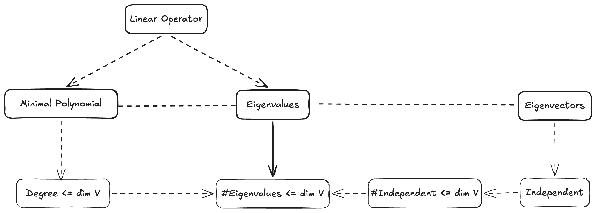
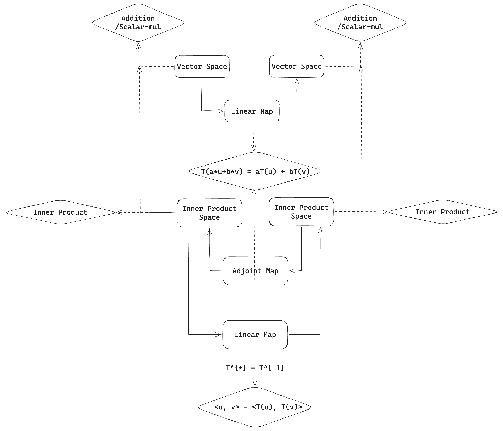
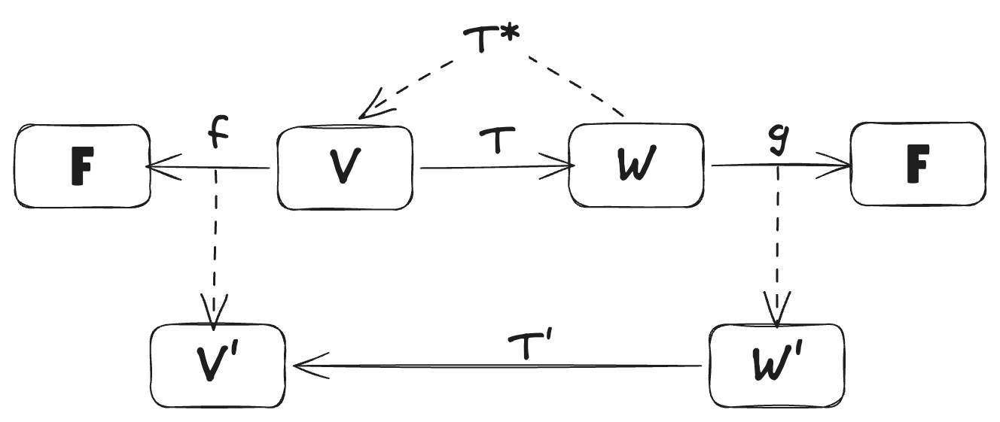

Table of Contents

## Table of Contents
- [Eigenvalues and Eigenvectors](#eigenvalues-and-eigenvectors)
  - [Invariant Subspaces](#invariant-subspaces)
    - [Eigenvalues](#eigenvalues)
    - [Polynomials Applies to Operators](#polynomials-applies-to-operators)
  - [The Minimal Polynomial](#the-minimal-polynomial)
    - [Eigenvalues on Odd-Dimensional Real Vector Spaces](#eigenvalues-on-odd-dimensional-real-vector-spaces)
  - [Upper-Triangular Matrices](#upper-triangular-matrices)
  - [Diagonalizable Operators](#diagonalizable-operators)
  - [Commuting Operators](#commuting-operators)
- [Inner Product Spaces](#inner-product-spaces)
  - [Inner Products and Norms](#inner-products-and-norms)
  - [Orthonormal Bases](#orthonormal-bases)
- [Operators on Inner Product Spaces](#operators-on-inner-product-spaces)
  - [Adjoint Linear Map](#adjoint-linear-map)
  - [Self-adjoint Operators](#self-adjoint-operators)
  - [Normal Operators](#normal-operators)
- [Multilinear Algebra and Determinants](#multilinear-algebra-and-determinants)
  - [Bilinear Forms and Quadratic Forms](#bilinear-forms-and-quadratic-forms)
    - [Bilinear Forms](#bilinear-forms)
    - [Symmetric Bilinear Forms](#symmetric-bilinear-forms)
    - [Quadratic Forms](#quadratic-forms)
  - [Alternating Multilinear Forms](#alternating-multilinear-forms)
  - [Determinants](#determinants)
  - [Tensor Products](#tensor-products)

 

# Eigenvalues and Eigenvectors

## Invariant Subspaces

**Definition 5.1 - Invariant Subspace**{#definition-5-1 .definition anchor}

Let $T \in \mathcal{L}(V)$ be a (linear) operator on vector space $V$. When we restrict $T$ to a subspace $U \subseteq V$, we are not sure the corresponding vectors will still lie in $U$. If they do, we say that $U$ is an invariant subspace under $T$. We call $T|_U$ is an operator on $U$.

 

Considering one special invariant subspace, that is, one-dimensional invariant subspace, which is spanned by only one vector $v \in V$. If this one-dimensional subspace is invariant under $T$, then the linear map $T$ only depends on where the basis vector $v$ is mapped, which leads to the concept of eigenvalues and eigenvectors:
$$
T v = \lambda v
$$

 

### Eigenvalues

**Definition 5.2 - Eigenvalue and Eigenvector** {#definition-5-2 .definition anchor}

Let $T \in \mathcal{L}(V)$ be a (linear) operator on vector space $V$. A scalar $\lambda \in \mathbb{F}$ is called an eigenvalue of $T$ if there exists a non-zero vector $v \in V$ such that
$$
T v = \lambda v.
$$
The vector $v$ is called an eigenvector corresponding to the eigenvalue $\lambda$.

 

**Lemma 5.1 - Equivalence of Eigenvalue**{#lemma-5-1 .lemma anchor}

Suppose $V$ is a finite-dimensional vector space and $T \in \mathcal{L}(V)$, and $\lambda \in \mathbb{F}$. The following statements are equivalent:

1. $\lambda$ is an eigenvalue of $T$.

2. $T - \lambda I$ is not injective.

3. $T - \lambda I$ is not surjective.

4. $\det(T - \lambda I) = 0$.

 

Proof

Regarding $(1) \iff (2)$, by $T v = \lambda v$, we have $(T - \lambda I_V) v = 0$. Since by linearity of vector space of $\mathcal{L}(V)$, $T - \lambda I_V$ is also a operator on $V$, and its kernel is non-trivial as basis vector $v$ is non-zero. Completing the proof of $(1) \iff (2)$.

By the properties of invertible linear map of the same dimension 
$$
\text{injectivity} \iff \text{surjectivity} \iff \text{bijectivity}
$$
, we have $(2) \iff (3) \iff (4)$, completing the proof.

 

**Lemma 5.2 - Linearly Independent Eigenvectors**{#lemma-5-2 .lemma anchor}

Eigenvectors corresponding to distinct eigenvalues of a linear operator are linearly independent.

 

Proof

Suppose $v_1, v_2, \dots, v_k$ are eigenvectors corresponding to distinct eigenvalues $\lambda_1, \lambda_2, \dots, \lambda_k$ of a linear operator $T$. We prove the statement by induction on $k$.

For $k = 1$, the statement is trivial since a single non-zero vector is linearly independent.

Assume the statement holds for $k-1$ eigenvectors (i.e. if any linear combination of $k - 1$ distinct eigenvectors equals zero, then all coefficients are zeros). Consider $k$ eigenvectors $v_1, v_2, \dots, v_k$ corresponding to distinct eigenvalues $\lambda_1, \lambda_2, \dots, \lambda_k$. Suppose
$$
a_1 v_1 + a_2 v_2 + \dots + a_k v_k = 0.
$$
Applying $T$ to both sides, we get
$$
a_1 \lambda_1 v_1 + a_2 \lambda_2 v_2 + \dots + a_k \lambda_k v_k = 0.
$$
Multiplying the first equation by $\lambda_k$ and subtracting from the second equation, we obtain
$$
a_1 (\lambda_1 - \lambda_k) v_1 + a_2 (\lambda_2 - \lambda_k) v_2 + \dots + a_{k-1} (\lambda_{k-1} - \lambda_k) v_{k-1} = 0.
$$
By the induction hypothesis, since $\lambda_i \ne \lambda_j$ for all $i \ne j$, we have $a_1 = a_2 = \dots = a_{k-1} = 0$. Substituting back into the original equation, we get $a_k v_k = 0$, which implies $a_k = 0$ since $v_k \neq 0$.

Hence, $v_1, v_2, \dots, v_k$ are linearly independent.

 

**Lemma 5.3 - Maximum Number of Eigenvalues**{#lemma-5-3 .lemma anchor}

A linear operator on an $n$-dimensional vector space has at most $n$ distinct eigenvalues.

 

Proof

By lemma 5.2, eigenvectors corresponding to distinct eigenvalues are linearly independent. Since a linear operator on an $n$-dimensional vector space cannot have more than $n$ linearly independent vectors, it follows that the number of distinct eigenvalues is at most $n$.

 

### Polynomials Applies to Operators

Operators is more poppular than general linear maps, owe that the basis of domain and codomain are the same, thus invertibility is well-defined. Therefore, we can composite one operator many times, more in general we can apply any finite-degree polynomials to them directly.

 

**Definition 5.3 - Polynomial Evaluation on Operator**{#definition-5-3 .definition anchor}

Let $T$ be a linear operator on a vector space $V$, and let $p(x) = a_0 + a_1 x + \dots + a_m x^m$ be a polynomial. The polynomial evaluation of $p$ on $T$ is defined as
$$
p(T) = a_0 I + a_1 T + \dots + a_m T^m,
$$
where $I$ is the identity operator on $V$. For simplicity, we call $p(T)$ as polynomial operator on $T$.

 

**Lemma 5.4 - Properties of Polynomial Operators**{#lemma-5-4 .lemma anchor}

Due to the naive invertibility property of operators, the commutativity of operators with themselves ensures that polynomial evaluations on operators are well-defined and behave as expected. Suppose $p, q \in \mathcal{P}(\mathbb{F})$ are two polynomials, then we have
$$
\begin{aligned}
\text{(a) } &p(T) + q(T) = (p+q)(T), \\
\text{(b) } &p(T) q(T) = (pq)(T), \\
\text{(c) } &p(T) q(T) = q(T) p(T).
\end{aligned}
$$

 

**Lemma 5.5 - Invariant of Null Space and Range of Polynomial Operators**{#lemma-5-5 .lemma anchor}

Suppose $T$ is a linear operator on a vector space $V$, and $p(x)$ is a polynomial. Then the null space and range of $p(T)$ are invariant under $T$, i.e.,
$$
\begin{aligned}
\text{(a) } &T(\text{null}(p(T))) \subseteq \text{null}(p(T)) \\
\text{(b) } &T(\text{range}(p(T))) \subseteq \text{range}(p(T)).
\end{aligned}
$$

Proof

Regarding (a), it is suffices to show that $\forall x \in T(\text{null}(p(T))) \to x \in \text{null}(p(T))$, which is equivalent with $\forall x \in \text{null}(p(T)) \to T(x) \in \text{null}(p(T))$.

By $p(T) \in \mathcal{L}(V)$, we have $p(T)(x) = 0$. And $T \in \mathcal{L}(V)$, we have $T(x) \in V$, by the commutativity of polynomial operators, we have:
$$
p(T) \circ T(x) = (p(T) \circ T)(x) = (T \circ p(T))(x) = T(p(T)(x)) = T(0) = 0.
$$
Thus $T(x) \in \text{null}(p(T))$.

Regarding (b), it is suffices to show that $\forall y \in \text{range}(p(T)) \to T(y) \in \text{range}(p(T))$.

Let $y \in \text{range}(p(T))$, then there exists $x \in V$ such that $y = p(T)(x)$. By the commutativity of polynomial operators, we have:
$$
T(y) = T(p(T)(x)) = (T \circ p(T))(x) = (p(T) \circ T)(x) = p(T)(T(x)) \in \text{range}(p(T)).
$$

 

> [!Warning] Polynomial Operators and Eigenvalues
> What is the relationship between polynomial operators and eigenvalues?

## The Minimal Polynomial

**Lemma 5.6 - Existence of Eigenvalues**{#lemma-5-6 .lemma anchor}

Every operator on a finite-dimensional vector space over an **algebraically closed field** has at least one eigenvalue.

Proof

We will show the proof on the perspective of the characteristic polynomial of the operator. Since the field is algebraically closed, *the characteristic polynomial has at least one root, which corresponds to an eigenvalue of the operator*.

Suppose $V$ is a finite-dimensional complex vector space of dimension $n$, and let $T$ be a linear operator on $V$. Choose a non-zero vector $v \in V$. Then
$$
v, T v, T^2 v, \dots, T^{n} v,
$$
is a list of dependent vectors in $V$ since $V$ has dimension $n$. Thus, there exist scalars $a_0, a_1, \dots, a_n$, not all zero, such that  
$$
a_0 v + a_1 T v + a_2 T^2 v + \dots + a_n T^n v = p(T)(v) = 0.
$$
where $p(x)$ is a non-constant polynomial of **smallest degree** such that $p(T)(v) = 0$. "algebraically closed" ensures the characteristic polynomial has at least one root in the field $\lambda \in \mathbb{F}$ such that $p(x) = (x - \lambda) q(x) = 0$, "Smallest degee" ensures that the quotient polynomial $q(\lambda) \ne 0$, and therefore we have: 
$$
p(T) (v) = ((T - \lambda I) q(T))(v) = (T - \lambda I)(q(T)(v)) = 0.
$$
concequently, $T - \lambda I = 0$ which implies that $v$ is an eigenvector of $T$ corresponding to the eigenvalue $\lambda$.

 

**Definition 5.4 - Minimal Polynomial**{#definition-5-4 .definition anchor}

The minimal polynomial of a linear operator $T$ on a finite-dimensional vector space $V$ is the unique monic polynomial $p \in \mathcal{P}(\mathbb{F})$ of smallest degree such that $p(T) = 0$. Furthermore, $\deg p \le \dim V$.

 

> [!Warning] Algebraically Closed Fields
> What is the relationship between minimal polynomial and eigenvalues? Given a linear operator $T$, the minimal polynomial of it always exists and be unique. But by lemma 5.6, the existence of eigenvalues still depends on the field being algebraically closed. By comparison, $\mathbb{R}$ is not algebraically closed, while $\mathbb{C}$ is.

 

**Lemma 5.7 - Relationship Between Minimal Polynomial and Eigenvalues**{#lemma-5-7 .lemma anchor}

Suppose $V$ is finite-dimensional and $T \in \mathcal{L}(V)$. 

- (a) If the field $\mathbb{F}$ which vector space is defined over is not algebraically closed, for example $\mathbb{R}$, then the zeros of the minimal polynomial of $T$ are the eigenvalues of $T$ in $\mathbb{F}$, if any exist.
- (b) If the field $\mathbb{F}$ is algebraically closed, for example $\mathbb{C}$, then there are at least one zero of the minimal polynomial of $T$ in $\mathbb{F}$, which corresponds to an eigenvalue of $T$.

This lemma also implies that the number of distinct eigenvalues of $T$ in $\mathbb{F}$ is at most the degree of the minimal polynomial of $T$, which in turn is at most $\dim V$. For now, we have two ways to show that the number of distinct eigenvalues is bounded by the dimension of the vector space. One is using the minimal polynomial, and the other is using eigenvectors directly.

 

**Lemma 5.8 - Invertible of Linear Operators**{#lemma-5-8 .lemma anchor}

Suppose $V$ is finite-dimensional and $T \in \mathcal{L}(V)$. Then $T$ is invertible if and only if $0$ is not an eigenvalue of $T$, which is equivalent to the minimal polynomial of $T$ not having $0$ as a root.

Proof

$T$ is not invertible, implying not injective, which means 
$$
\exist u, v \in V, T(u) = T(v) \to u \ne v
$$
Thus $T(u) - T(v) = T(u - v) = 0 = 0 \cdot (u - v)$, which shows that $0$ is an eigenvalue of $T$ with eigenvector $u - v \ne 0$. By lemma 5.7, $0$ is a root of the minimal polynomial of $T$, implying that the constant term of the minimal polynomial is $0$.

 

### Eigenvalues on Odd-Dimensional Real Vector Spaces

By lemma 5.7, we have concluded that not every linear operator on a real vector space has eigenvalues. But in some special circumstances, such as when the vector space is odd-dimensional, we can guarantee the existence of eigenvalues.

 

## Upper-Triangular Matrices

For example, 
$$
\begin{pmatrix}
a_{11} & a_{12} & \cdots & a_{1n} \\
0 & a_{22} & \cdots & a_{2n} \\
\vdots & \vdots & \ddots & \vdots \\
0 & 0 & \cdots & a_{nn}
\end{pmatrix}
$$
is an upper-triangular matrix.

 

Diagonal matrix is a special case of an upper-triangular matrix where all the entries above and below the main diagonal are zero.

Before we dive into diagonal matrix of linear operator, we first need to understand upper-triangular matrices, as they provide a stepping stone towards diagonalization.

 

**Lemma 5.9 - Conditions for Upper-Triangular Matrix**{#lemma-5-9 .lemma anchor}

Suppose $T \in \mathcal{L}(V)$ is a linear operator on a finite-dimensional vector space $V$. Then the following conditions are equivalent:
- (a) The matrix of $T$ with respect to some basis $v_1, ..., v_n$ of $V$ is upper-triangular.
- (b) $\text{span}(v_1, ..., v_k)$ is invariant under $T$ for each $k = 1, ..., n$.

Proof

Since $\mathcal{M}(T)$ is an upper-triangular matrix with respect to the basis $v_1, ..., v_n$, by the definition of linear map matrix, we have $T(v_j) \in \text{span}(v_1, ..., v_j) \subseteq \text{span}(v_1, ..., v_k)$ for each $j = 1, ..., k$, so 
$$
T(c_1 v_1 + \cdots + c_k v_k) = c_1 T(v_1) + \cdots + c_k T(v_k) \in \text{span}(v_1, ..., v_k)
$$
. Completing the proof of the equivalence between (a) and (b).

 

**Lemma 5.10 - Linear Operator Equation**{#lemma-5-10 .lemma anchor}

Suppose $T \in \mathcal{L}(V)$ is a linear operator on a finite-dimensional vector space $V$, and it has an upper-triangular matrix with diagonal entries $\lambda_1, ..., \lambda_n$. Then  
$$
(T - \lambda_1 I)(T - \lambda_2 I) \cdots (T - \lambda_n I) = 0
$$

 

**Lemma 5.11 - Determination of Eigenvalues from Upper-Triangular Matrix**{#lemma-5-11 .lemma anchor}

Suppose $T \in \mathcal{L}(V)$ is a linear operator on a finite-dimensional vector space $V$, and it has an upper-triangular matrix with diagonal entries $\lambda_1, ..., \lambda_n$. Then the eigenvalues of $T$ are precisely $\lambda_1, ..., \lambda_n$.

 

Not every linear operator has an upper-triangular matrix representation with respect to some basis. Those that do are called triangularizable operators.

**Lemma 5.12 - Condition for Having Upper-Triangular Matrix**{#lemma-5-12 .lemma anchor}

Suppose $T \in \mathcal{L}(V)$ is a linear operator on a finite-dimensional vector space $V$. Then $T$ has an upper-triangular matrix with respect to some basis of $V$ if and only if the minimal polynomial of $T$ equals  
$$
(x - \lambda_1) \cdots (x - \lambda_m)
$$
for some scalars $\lambda_1, ..., \lambda_m \in \mathbb{F}$, where $m \le n$. More specially, if the field $\mathbb{F}$ is algebraically closed, then every linear operator on a finite-dimensional vector space over $\mathbb{F}$ has an upper-triangular matrix with respect to some basis.

 

## Diagonalizable Operators

**Definition 5.5 - Eigenspace**{#definition-5-5 .definition anchor}

Suppose $T \in \mathcal{L}(V)$ is a linear operator on a finite-dimensional vector space $V$, and $\lambda$ is an eigenvalue of $T$. The eigenspace corresponding to $\lambda$ is defined as
$$
E(\lambda, T) = \text{null}(T - \lambda I) = \{v \in V : T(v) = \lambda v\}.
$$

We see that each eigenspace is a subspace of $V$, meaning it is closed under vector addition and scalar multiplication, i.e.,
$$
v_1, v_2 \in E(\lambda, T), \alpha, \beta \in \mathbb{F} \implies \alpha v_1 + \beta v_2 \in E(\lambda, T).
$$

> [!Warning]
> Each eigenvalue corresponds to a eigenspace, so what is the relationship between these eigenspaces?

 

**Lemma 5.13 - Sum of Eigenspaces**{#lemma-5-13 .lemma anchor}

Suppose $T \in \mathcal{L}(V)$ is a linear operator on a finite-dimensional vector space $V$, and $\lambda_1, ..., \lambda_m$ are distinct eigenvalues of $T$. Then the sum of the corresponding eigenspaces is direct, i.e.,
$$
E(\lambda_1, T) \oplus \cdots \oplus E(\lambda_m, T) \subseteq V.
$$
Furthermore, if $V$ is finite-dimensional, then the sum of the eigenspaces equals $V$, i.e.,
$$
\dim E(\lambda_1, T) \oplus \cdots \oplus E(\lambda_m, T) \le \dim V.
$$

Proof

(a) In order to show the direct-sum, it is suffices to show that : the only way to write the zero vector as a sum of vectors from each eigenspace is by taking each vector to be zero, i.e.,
$$
0 = v_1 + \cdots + v_m,
$$
where $v_i \in E(\lambda_i, T)$ for each $i = 1, ..., m$. We need to show that each $v_i = 0$.

Because each eigenvector $v_i$ corresponds to a distinct eigenvalue $\lambda_i$, they are linearly independent. Therefore, $v_i = 0$ for each $i = 1, ..., m$.

(b) Since the sum of the eigenspaces is direct, then we have 
$$
\dim (E(\lambda_1, T) \oplus \cdots \oplus E(\lambda_m, T)) = \dim E(\lambda_1, T) + \cdots + \dim E(\lambda_m, T).
$$
and $E(\lambda_1, T) \oplus \cdots \oplus E(\lambda_m, T) \subseteq V$ implies 
$$
\dim (E(\lambda_1, T) \oplus \cdots \oplus E(\lambda_m, T)) \le \dim V.
$$
Completing the proof.

 

**Lemma 5.14 - Euqivalent Conditions for Diagonalizability**{#lemma-5-14 .lemma anchor}

Suppose $T \in \mathcal{L}(V)$ is a linear operator on a finite-dimensional vector space $V$. Let $\lambda_1, ..., \lambda_m$ be the distinct eigenvalues of $T$. Then the following are equivalent:

1. $T$ is diagonalizable.

2. $V$ has a basis consisting of eigenvectors of $T$.

3. The sum of the eigenspaces corresponding to $\lambda_1, ..., \lambda_m$ equals $V$, i.e.,
   $$
   E(\lambda_1, T) \oplus \cdots \oplus E(\lambda_m, T) = V.
   $$

4. $\dim E(\lambda_1, T) + \cdots + \dim E(\lambda_m, T) = \dim V.$

 

Proof

Suppose the diagonal matrix of linear operator $T$ with respect to some basis $\{v_1, ..., v_n\}$ of $V$ is 
$$
\text{diag}(\lambda_1, ..., \lambda_n),
$$
where $\lambda_j$ are the eigenvalues corresponding to the basis vectors $v_j$. Note that $m \le n$ implies that it is possible multiple eigenvectors share the same eigenvalue.

 

For $(1) \iff (2)$, recalling the upper-triangular matrix of linear operator, $T v_j \in \text{span}(v_1, ..., v_j)$ for each $j \le n$, where $\{v_1, ..., v_n\}$ is a basis of $V$. Diagonal matrix is more strict than upper-triangular matrix, as it only has diagonal entries. By the definition of linear map matrix, we have $T v_j = \lambda_j v_j$ for each $j$, which shows that each basis vector $v_j$ is an eigenvector corresponding to eigenvalue $\lambda_j$. Hence, $(1) \iff (2)$.

For $(2) \iff (3)$, $E(\lambda_j, T)$ is a subspace of $V$ for each $j = 1, ..., m$, thus $E(\lambda_1, T) \oplus \cdots \oplus E(\lambda_m, T)$ is also a subspace of $V$. So in order to show $V = E(\lambda_1, T) \oplus \cdots \oplus E(\lambda_m, T)$, it suffices to show that $V \subseteq E(\lambda_1, T) \oplus \cdots \oplus E(\lambda_m, T)$. 

Since eigenvectors $v_1, ..., v_n$ form a basis of $V$, then 
$$
v = c_1 v_1 + \cdots + c_n v_n,
$$
Since $v_j \in E(\lambda_j, T)$ for each $j$, we have 
$$
v = c_1 v_1 + \cdots + c_n v_n \in E(\lambda_1, T) \oplus \cdots \oplus E(\lambda_m, T),
$$
which shows that the sum of the eigenspaces equals $V$. Hence, $(2) \iff (3)$.

For $(3) \iff (4)$, 
$$
\dim (E(\lambda_1, T) \oplus \cdots \oplus E(\lambda_m, T)) = \dim E(\lambda_1, T) + \cdots + \dim E(\lambda_m, T).
$$
and $E(\lambda_1, T) \oplus \cdots \oplus E(\lambda_m, T) = V$ implies 
$$
\dim (E(\lambda_1, T) \oplus \cdots \oplus E(\lambda_m, T)) = \dim V.
$$

 

**Lemma 5.15 - Enough Eigenvalues for Diagonalizability**{#lemma-5-15 .lemma anchor}

Suppose $T \in \mathcal{L}(V)$ is a linear operator on an $n$-dimensional vector space $V$, and it has $\dim V$ distinct eigenvalues. Then $T$ is diagonalizable.

 

Proof

By lemma 5.14, we observe that : $n$ distinct eigenvectors forming a basis of $V$ does not guarantee that they come from $n$ distinct eigenvalues, implying that some eigenvalues has mutiplicity than one. 

This lemma is a special case of lemma 5.14, where the number of distinct eigenvalues equals the dimension of the vector space. We just omit the proof here.

 

**Lemma 5.16 - Sufficient and Necessary Conditions for Diagonalizability**{#lemma-5-16 .lemma anchor}

Suppose $T \in \mathcal{L}(V)$ is a linear operator on an $n$-dimensional vector space $V$. Then $T$ is diagonalizable if and only if the minimal polynomial of $T$ equals  
$$
\prod_{i=1}^m (x - \lambda_i),
$$
where $\lambda_1, ..., \lambda_m$ are the distinct eigenvalues of $T$.

> [!Important] Criterias for Diagonalizability
> For now, we have four criterias for diagonalizability of a linear operator, where three of them come from lemma 5.14 and the fourth one comes from lemma 5.15. The difference is that :
> 1. lemma 5.15 is a **sufficient condition** for diagonalizability, but not **necessary condition**, which means there are other ways to achieve diagonalizability without having $\dim V$ distinct eigenvalues, for example the three conditions (2), (3), and (4) in lemma 5.14.
> 2. lemma 5.16 provides a **necessary and sufficient condition** for diagonalizability, which means it characterizes all diagonalizable operators through their minimal polynomials.

 

**Lemma 5.17 - Restriction of Diagonalizable Operators**{#lemma-5-17 .lemma anchor}

Suppose $T \in \mathcal{L}(V)$ is a diagonalizable linear operator on an $n$-dimensional vector space $V$, and $W$ is a $T$-invariant subspace of $V$. Then the restriction of $T$ to $W$, denoted by $T|_W$, is also diagonalizable.

 

> [!Important]
> In this section, we have learned that a linear operator is diagonalizable only when using some special basis consisting of its eigenvectors. The choice of such a basis is crucial for representing the operator in a diagonal form.

## Commuting Operators

If two operators are commuting, i.e., $AB = BA$, then they are said to commute with each other.

**Lemma 5.18 - Commuting Operators and Commuting Matrices**{#lemma-5-18 .lemma anchor}

Suppose $S$ and $T$ are two linear operators on a finite-dimensional vector space $V$, and $v_1, ..., v_n$ is a basis of $V$. Then $S$ and $T$ commute if and only if $\mathcal{M}(S, \{v_1, ..., v_n\})$ and $\mathcal{M}(T, \{v_1, ..., v_n\})$ commute.

 

**Lemma 5.19 - Eigenspace is invariant under commuting operator**{#lemma-5-19 .lemma anchor}

Suppose $S, T \in \mathcal{L}(V)$ are two commuting linear operators on a finite-dimensional vector space $V$ and $\lambda \in \mathbb{F}$. Then $E(\lambda, S)$, the eigenspace of $S$ corresponding to $\lambda$, is invariant under $T$.

Proof

To show the invariance of $E(\lambda, S)$ under $T$, it is sufficient to show :
$$
\forall v \in E(\lambda, S) \to T(v) \in E(\lambda, S) \iff S(T(v)) = \lambda \cdot T(v)
$$

Since $S, T$ commute, $S T = T S$, so we have $S(T(v)) = T(S(v)) = T(\lambda v) = \lambda T(v)$, which shows that $T(v) \in E(\lambda, S)$.

 

**Lemma 5.20 - Simultaneous Diagonalizability of Commuting Operators**{#lemma-5-20 .lemma anchor}

Two diagonalizable linear operators on a finite-dimensional vector space $V$ commute if and only if they are simultaneously diagonalizable, i.e., there exists a basis of $V$ consisting of eigenvectors common to both operators.

 

# Inner Product Spaces

So far, we have discussed 
- linear structure of vector spaces, 
- linear maps (operators) on them,
- and properties of these operators. 

Actually, there are also some geometric features (for example, lengths and angles) for vector spaces, which can be captured using the concept of an inner product. Similarly, we will then discuss linear operators on inner product spaces and their properties.

## Inner Products and Norms

**Definition 6.1 - Euclidean (Inner Product) Space**{#definition-6-1 .definition anchor}

An inner product on a vector space $V$ over the field $\mathbb{F}$ (where $\mathbb{F}$ is typically $\mathbb{R}$ or $\mathbb{C}$) is a function $\langle \cdot, \cdot \rangle : V \times V \to \mathbb{F}$ that satisfies the following properties for all $u, v, w \in V$ and all $\alpha \in \mathbb{F}$:

1. **Conjugate Symmetry**: $\langle u, v \rangle = \overline{\langle v, u \rangle}$
2. **Linearity in the First Argument**: $\langle \alpha u + v, w \rangle = \alpha \langle u, w \rangle + \langle v, w \rangle$
3. **Positive-Definiteness**: $\langle v, v \rangle \geq 0$ with equality if and only if $v = 0$

A vector space $V$ equipped with an inner product $\langle \cdot, \cdot \rangle$ is called an **inner product space** or **Euclidean space**.

 

**Definition 6.2 - Norm Induced by Inner Product**{#definition-6-2 .definition anchor}

For a vector $v \in V$, the norm induced by the inner product is defined as
$$
\|v\| = \sqrt{\langle v, v \rangle}.
$$
This norm satisfies the usual properties of a norm, including positivity, homogeneity, and the triangle inequality, that is,
$$
\|v\| \geq 0, \quad \|v\| = 0 \iff v = 0, \\
\quad \|\alpha v\| = |\alpha| \cdot \|v\|, \\
\quad \|u + v\| \leq \|u\| + \|v\|.
$$

 

**Definition 6.3 - Orthogonality**{#definition-6-3 .definition anchor}

Two vectors $u, v \in V$ are said to be **orthogonal** if their inner product is zero, i.e.,
$$
\langle u, v \rangle = 0.
$$

 

**Lemma 6.1 - Pythagorean Theorem for Inner Product Spaces**{#lemma-6-1 .lemma anchor}

If $u, v \in V$ are orthogonal, then
$$
\|u + v\|^2 = \|u\|^2 + \|v\|^2.
$$

Proof

If $u$ and $v$ are orthogonal, then $\langle u, v \rangle = \overline{\langle v, u \rangle} = 0$ implies $\langle v, u \rangle = 0$, thus 
$$
\|u + v\|^2 = \langle u + v, u + v \rangle = \langle u, u \rangle + \langle u, v \rangle + \langle v, u \rangle + \langle v, v \rangle = \|u\|^2 + \|v\|^2.
$$

 

**Lemma 6.4 - Cauchy-Schwarz Inequality**{#lemma-6-4 .lemma anchor}

For all vectors $u, v \in V$, the Cauchy-Schwarz inequality states that
$$
|\langle u, v \rangle| \leq \|u\| \cdot \|v\|.
$$
Equality holds if and only if $u$ and $v$ are linearly dependent.

 

**Lemma 6.5 - Triangle Inequality**{#lemma-6-5 .lemma anchor}

For all vectors $u, v \in V$, the triangle inequality states that
$$
\|u + v\| \leq \|u\| + \|v\|.
$$
Equality holds if and only if $u$ and $v$ are linearly dependent.

 

**Lemma 6.6 - Parallelogram Law**{#lemma-6-6 .lemma anchor}

For all vectors $u, v \in V$, the parallelogram law states that
$$
\|u + v\|^2 + \|u - v\|^2 = 2\|u\|^2 + 2\|v\|^2.
$$

 

## Orthonormal Bases

**Definition 6.4 - Orthonormal**{#definition-6-4 .definition anchor}

An orthonormal set of vectors in an inner product space $V$ is a set of vectors that are all unit vectors (norm equal to 1) and mutually orthogonal. Formally, a set $\{e_1, e_2, \dots, e_n\} \subseteq V$ is orthonormal if
$$
\langle e_i, e_j \rangle = \delta_{ij}, \quad \text{for all } i, j = 1, 2, \dots, n,
$$
where $\delta_{ij}$ is the Kronecker delta, which is 1 if $i = j$ and 0 otherwise.

 

We have two properties about orthonormal list of vectors :
1. $\|a_1 e_1 + ... + a_n e_n\|^2 = |a_1|^2 + ... + |a_n|^2$ for any scalars $a_1, \dots, a_n$.
2. Every orthonormal list of vectors is linearly independent.

 

**Lemma 6.7 - Bessel's Inequality**{#lemma-6-7 .lemma anchor}

Let $\{e_1, e_2, \dots, e_n\}$ be an orthonormal set of vectors in an inner product space $V$. For any vector $v \in V$, Bessel's inequality states that
$$
\sum_{i=1}^n |\langle v, e_i \rangle|^2 \leq \|v\|^2.
$$

> [!Note]
> $\langle v, e_i \rangle$ represents the inner product of the vector $v$ with the orthonormal basis vector $e_i$, which can be directly interpreted as the scalar projection (or coefficient) of $v$ onto $e_i$.

 

**Definition 6.5 - Orthonormal Basis**{#definition-6-5 .definition anchor}

An orthonormal basis of an inner product space $V$ is an orthonormal set of vectors that spans the entire space $V$. Formally, a set $\{e_1, e_2, \dots, e_n\} \subseteq V$ is an orthonormal basis if it is orthonormal and every vector $v \in V$ can be expressed as a linear combination of the basis vectors:
$$
v = \sum_{i=1}^n \langle v, e_i \rangle e_i.
$$

> [!Note]
> Orthonormal basis is a special kind of basis where all the basis vectors are orthonormal, meaning they are all unit vectors and mutually orthogonal. But how to find such a basis in practice? One common method is the Gram-Schmidt process, which takes a linearly independent set of vectors and constructs an orthonormal basis from them.

 

**Definition 6.6 - Orthogonal Decomposition**{#definition-6-6 .definition anchor}

Suppose $u, v \in V$, with $v \ne 0$. Set 
$$
w = \frac{\langle u, v \rangle}{\|v\|^2} v,
$$
then $u$ can be decomposed as
$$
u = w + (u - w),
$$
where $w$ is parallel to $v$ and $u - w$ is orthogonal to $v$.

> [!Note]
> It implies that any vector $u$ can be decomposed into a component parallel to another vector $v$ and a component orthogonal to $v$.

 

**Lemma 6.8 - Gram-Schmidt Procedure**{#lemma-6-8 .lemma anchor} 

Suppose $v_1, ..., v_m$ is a linearly independent set of vectors in an inner product space $V$. The Gram-Schmidt procedure constructs an orthonormal set of vectors $e_1, ..., e_m$ as follows:
1. Let $f_1 = v_1$
2. For $k = 2, ..., m$ inductively define
   $$
   f_k = v_k - \sum_{i=1}^{k-1} \frac{\langle v_k, f_i \rangle}{\|f_i\|^2} f_i,
   $$
3. For each $k = 1, ..., m$, let
   $$
   e_k = \frac{f_k}{\|f_k\|}.
   $$
   Then $e_1, ..., e_m$ is an orthonormal set of vectors that spans the same subspace as $\{v_1, ..., v_m\}$, i.e., 
   $$
   \text{span}\{e_1, ..., e_m\} = \text{span}\{v_1, ..., v_m\}.
   $$

> [!Note]
> The general ideal is that, firstly by definition 6.6, we construct a set of orthonormal vectors $f_1, ..., f_m$ from the original linearly independent set $v_1, ..., v_m$. Secondly, normalize them to obtain the orthonormal set $e_1, ..., e_m$.

 

**Lemma 6.9 - Orthonormal List to Orthonormal Basis**{#lemma-6-9 .lemma anchor} 

The length of any orthonormal list is not guarrenteed to be $\dim V$, but it can always be extended to form an orthonormal basis of $V$ by applying the Gram-Schmidt procedure to additional linearly independent vectors until the basis is complete.

 

**Lemma 6.10 - Upper-triangular Matrix with Respect to Orthonormal Basis**{#lemma-6-10 .lemma anchor} 

By lemma 5.12, every linear operator on a finite-dimensional inner product space has an upper-triangular matrix with respect to **some** basis. It does not specify which basis, but in fact, it can be chosen to be an orthonormal basis.

Suppose $T \in \mathcal{L}(V)$, where $V$ is a finite-dimensional inner product space. Then $T$ has an upper-triangular matrix with respect to some orthonormal basis of $V$ if and only if the minimal polynomial of $T$ splits into linear factors over the field $\mathbb{F}$. That is,
$$
\text{minimal polynomial of } T = \prod_{i=1}^{m} (x - \lambda_i), \quad \lambda_i \in \mathbb{F}.
$$

 

**Definition 6.7 - Orthogonal Complement**{#definition-6-7 .definition anchor} 

Given $U$ is a subset of $V$, the orthogonal complement of $U$, denoted by $U^\perp$, is defined as
$$
U^\perp = \{v \in V \mid \langle v, u \rangle = 0 \text{ for all } u \in U\}.
$$

Orthogonal complement has the following properties:
1. $U^\perp$ is a subspace of $V$.
2. $\{0\}^\perp = V$
3. $V^\perp = \{0\}$.
4. $U \cap U^\perp = \{0\}$.
5. if $G \subseteq H$, then $H^\perp \subseteq G^\perp$.

 

> [!Warning]
> We did not specify that $U$ is a subspace in the definition of orthogonal complement. Therefore, $U^\perp$ is always a subspace of $V$ regardless of whether $U$ itself is a subspace.

**Lemma 6.11 - Direct-sum Decomposition with Orthogonal Complement**{#lemma-6-11 .lemma anchor} 

Suppose $U$ is a subspace of a finite-dimensional inner product space $V$. Then
$$
V = U \oplus U^\perp.
$$

In this case, we have :
$$
\begin{aligned}
&\text{(a) } \dim V = \dim U + \dim U^\perp \\
&\text{(b) } U = (U^\perp)^\perp \\

\end{aligned}
$$

 

**Definition 6.8 - Orthogonal Projection**{#definition-6-8 .definition anchor}  

Suppose $U$ is a finite-dimensional subspace of a finite-dimensional inner product space $V$. The orthogonal projection of $V$ onto $U$ is the linear operator $P_U \in \mathcal{L}(V)$ defined as follows : For each $v \in V$, write $v = u + w$, where $u \in U$ and $w \in U^\perp$. Then
$$
P_U(v) = u.
$$

> [!Note]
> We know that, given a vector $v \in V$, there are many ways to decompose it $v = u + w$, where $u, w \in V$. However there is only one way to decompose it such that $u \in U$ and $w \in U^\perp$. This ensures that the orthogonal projection $P_U(v)$ is well-defined. The linear operator is also used to extract the component of $v$ that lies in $U$.

The properties of orthogonal projection include:
1. $P_U \in \mathcal{L}(V)$.
2. $P_U u = u$ for all $u \in U$.
3. $P_U w = 0$ for all $w \in U^\perp$.
4. $\text{range}(P_U) = U$.
5. $\text{null}(P_U) = U^\perp$.
6. $v - P_U(v) \in U^\perp$ for all $v \in V$.
7. $P_U^2 = P_U$ (idempotent property).
8. $\|P_U(v)\| \leq \|v\|$ for all $v \in V$.
9. if $e_1, ..., e_m$ is an orthonormal basis of $U$, then for all $v \in V$,
$$
P_U(v) = \sum_{i=1}^m \langle v, e_i \rangle e_i.
$$

 

**Lemma 6.12 - Minimizing Distance to a Subspace**{#lemma-6-12 .lemma anchor}   

Suppose $U$ is a finite-dimensional subspace of a finite-dimensional inner product space $V$. For any $v \in V$, the distance from $v$ to $U$ is minimized by the orthogonal projection of $v$ onto $U$. In other words,
$$
\|v - P_U(v)\| = \min_{u \in U} \|v - u\|.
$$

 

# Operators on Inner Product Spaces

Before talking about adjoint operators, let's first explore the general adjoint linear map and its properties.

As we know, linear map is a homomorphism between vector spaces, preserving the **algebraic operations** of vector addition and scalar multiplication, we call this property as linearity. That is, there is one-to-one correspondence between the elements in the domain and the elements in the codomain, i.e.,
$$
a u + b v \mapsto a T(u) + b T(v) \quad \text{for all } v, u \in V \text{ and } a, b \in \mathbb{F}.
$$

----

Inner product space is a special vector space which has an extra operation beyond vector addition and scalar multiplication, namely the inner product, that allows us to measure angles and lengths of vectors geometrically. But, inner product operation is not closure, it maps a pair of vectors to a scalar in the underlying field. So in general, we cannot expect the inner product operation to be preserved by linear maps. Furthermore, there is an equivalence between the inner product of two vectors in domain and the inner product of their images in the codomain under the linear map when the adjoint map is just the reversed of the linear map. That is, 
$$
\langle T(u), T(v) \rangle = \langle u, T^* \circ T (v) \rangle = \langle u, v \rangle \text{ if } T^* = T^{-1}.
$$

## Adjoint Linear Map

**Definition 7.1 - Adjoint Function**{#definition-7-1 .definition anchor}

Suppose $V$ is a finite-dimensional inner product space and $T \in \mathcal{L}(V, W)$. The adjoint function of $T$, denoted by $T^* : W \to V$ such that
$$
\langle T v, w \rangle = \langle v, T^* w \rangle \quad \text{for all } v \in V, w \in W.
$$

> [!Note]
> The left-hand side of the equation is a inner product in $W$, and the right-hand side is the innner product in $V$. It seems like they have the same value in underline field. But how to make it happen, or how the adjoint operator $T^*$ is computed anyway?

Comuting the adjoint operator :

1. Fix $u \in V, x \in W$, define $T \in \mathcal{L}(V, W)$ by $T(v) = \langle v, u \rangle x$ for all $v \in V$.

2. Then 
    $$
    \langle T v, w \rangle = \langle \langle v, u \rangle x, w \rangle = \langle v, u \rangle \langle x, w \rangle = \langle v, \langle x, w \rangle u \rangle.
    $$
    Hence, the adjoint operator $T^* \in \mathcal{L}(W, V)$ is given by $T^*(w) = \langle x, w \rangle u$ for all $w \in W$.

 

**Lemma 7.1 - Adjoint Function as a Linear Map**{#lemma-7-1 .lemma anchor}

If $T \in \mathcal{L}(V, W)$, then the adjoint function $T^* \in \mathcal{L}(W, V)$ is also a linear map.

Proof

To show function $T^*$ is a linear map, we need to check its linearity property, i.e.,
$$
\begin{aligned}
&\text{(a) } T^*(w_1 + w_2) = T^*(w_1) + T^*(w_2). \\
&\text{(b) } T^*(\lambda w) = \lambda \cdot T^*(w) 
\end{aligned}
$$

Regarding (a), let $v \in V$, apply a inner product on the left-hand sides with $v$, we get
$$
\langle T^*(w_1 + w_2), v \rangle = \langle w_1 + w_2, T v \rangle = \langle w_1, T v \rangle + \langle w_2, T v \rangle = \langle T^*(w_1), v \rangle + \langle T^*(w_2), v \rangle = \langle T^*(w_1) + T^*(w_2), v \rangle.
$$
Hence, $T^*(w_1 + w_2) = T^*(w_1) + T^*(w_2)$, completing the proof of (a).

Regarding (b), similarly, let $v \in V$, apply a inner product on the left-hand side with $v$, we get
$$
\langle T^*(\lambda w), v \rangle = \langle \lambda w, T v \rangle = \lambda \langle w, T v \rangle = \lambda \langle T^*(w), v \rangle = \langle \lambda \cdot T^*(w), v \rangle.
$$
Hence, $T^*(\lambda w) = \lambda \cdot T^*(w)$, completing the proof of (b).

 

**Lemma 7.2 - Properties of the Adjoint Linear Map**{#lemma-7-2 .lemma anchor}        

Suppose $T \in \mathcal{L}(V, W)$. Then 
1. $(S + T)^* = S^* + T^*$ for all $S \in \mathcal{L}(V, W)$.
2. $(\lambda T)^* = \overline{\lambda} T^*$ for all $\lambda \in \mathbb{F}$.
3. $(T^*)^* = T$.
4. $(ST)^* = T^* S^*$ for all $S \in \mathcal{L}(W, U)$ (here $U$ is another finite-dimensional inner product space over the same field $\mathbb{F}$). 
5. $I^* = I$ where $I$ is the identity operator on $V$.
6. if $T$ is invertible, then $T^*$ is also invertible and $(T^*)^{-1} = (T^{-1})^*$.

Proof

The proofs of these properties follow directly from the definition of the adjoint operator and the linearity of the inner product.

1. For all $v \in V$ and $w \in W$, we have
    $$
    \langle (S + T)^* w, v \rangle = \langle w, (S + T) v \rangle = \langle w, S v \rangle + \langle w, T v \rangle = \langle S^* w, v \rangle + \langle T^* w, v \rangle = \langle (S^* + T^*) w, v \rangle.
    $$
    Hence, $(S + T)^* = S^* + T^*$.

2. For all $v \in V$ and $w \in W$, we have
    $$
    \langle (\lambda T)^* w, v \rangle = \langle w, (\lambda T) v \rangle = \langle w, \lambda T v \rangle = \overline{\lambda} \langle w, T v \rangle = \overline{\lambda} \langle T^* w, v \rangle = \langle \overline{\lambda} T^* w, v \rangle.
    $$
    Hence, $(\lambda T)^* = \overline{\lambda} T^*$.

3. For all $v \in V$ and $w \in W$, we have
    $$
    \langle (T^*)^* v, w \rangle = \langle v, T^* w \rangle = \langle T v, w \rangle.
    $$
    Hence, $(T^*)^* = T$.

4. For all $v \in V$ and $u \in U$, we have
    $$
    \langle (ST)^* u, v \rangle = \langle u, ST v \rangle = \langle u, S(T v) \rangle = \langle S^* u, T v \rangle = \langle T^* S^* u, v \rangle.
    $$
    Hence, $(ST)^* = T^* S^*$.

5. For all $v, w \in V$, we have
    $$
    \langle I^* v, w \rangle = \langle v, I w \rangle = \langle v, w \rangle.
    $$
    Hence, $I^* = I$.

6. Since $T$ is invertible, we have $T^{-1} T = I$. Applying the adjoint operator to both sides, by (4) and (5), we get
    $$
    (T^{-1} T)^* = I^* \implies (T^*) (T^{-1})^* = I \implies (T^*)^{-1} = (T^{-1})^*.
    $$

 

**Lemma 7.3 - Null Space and Range of Adjoint Linear Map**{#lemma-7-3 .lemma anchor}

Suppose $T \in \mathcal{L}(V, W)$. Then
1. $\mathrm{null}(T^*) = \mathrm{range}(T)^\perp$.
2. $\mathrm{range}(T^*) = \mathrm{null}(T)^\perp$.
3. $\mathrm{null}(T) = \mathrm{range}(T^*)^\perp$.
4. $\mathrm{range}(T) = \mathrm{null}(T^*)^\perp$.

Proof

Regarding (1), let $w \in W$, by the definition 6.7 of orthogonal complement, we have :
$$
w \in \mathrm{null}(T^*) \iff T^* (w) = 0 \iff
\langle T^* w, v \rangle = 0 \quad \forall v \in V \iff
\langle w, T v \rangle = 0 \quad \forall v \in V \iff
w \in \mathrm{range}(T)^\perp
$$
thus $\mathrm{null}(T^*) = \mathrm{range}(T)^\perp$.

Replacing $T$ with $T^*$ on (4), by property (3) in lemma 7.2, we get (2).

Replacing $T$ with $T^*$ on (1), by property (3) in lemma 7.2, we get (3).

Applying orthogonal complement on both side of (1), we get (4).

 

**Definition 7.2 - Conjugate Transpose (Adjoint)**{#definition-7-2 .definition anchor}

The conjugate transpose of a $m \times n$ matrix $A$ is the $n \times m$ matrix $A^*$ obtained by taking the transpose of $A$ and then taking the complex conjugate of each entry. That is,
$$
(A^*)_{j, k} = \overline{A_{k, j}}
$$

> [!Note]
> As we know, a linear map $T$ can be represented by a matrix $A$, so is there any relationship between the adjoint of a matrix $A^*$ and the adjoint $T^*$ of the corresponding linear map $T$?

 

**Lemma 7.4 - Adjoint Matrix and Adjoint Linear Map**{#lemma-7-4 .lemma anchor}

Let $T \in \mathcal{L}(V, W)$. Suppose $e_1, ..., e_n$ is an orthonormal basis of $V$ and $f_1, ..., f_m$ is an orthonormal basis of $W$. Then $\mathcal{M}(T^*, (f_1,..., f_m), (e_1,..., e_n))$ is the conjugate transpose of $\mathcal{M}(T, (e_1,..., e_n), (f_1,..., f_m))$. In other words,  
$$
\mathcal{M}(T^*) = (\mathcal{M}(T))^*
$$  

Proof

By the definition of matrix of linear map, the $k$-th column of $\mathcal{M}(T^*)$ is given by the coordinates of $T^*(f_k)$ with respect to the basis $(e_1, ..., e_n)$. That is,
$$
T^*(f_k) = c_{1, k} \cdot e_1 + ... + c_{n, k} \cdot e_n \in W
$$
where $c_{j, k}$ is the $(j, k)$-th entry of the matrix $\mathcal{M}(T^*)$.

----

By the definition of orthonormal basis, vector $T^*(f_k)$ can be uniquely expressed as a linear combination of the orthonormalbasis $(e_1, ..., e_n)$:
$$
T^*(f_k) = \sum_{j=1}^n \langle T^*(f_k), e_j \rangle e_j
$$
which implies that the $(j, k)$-th entry of $\mathcal{M}(T^*)$ is given by
$$
c_{j, k} = \langle T^*(f_k), e_j \rangle
$$

---

By the definition of adjoint of linear map, we have 
$$
\langle T^*(f_k), e_j \rangle = \langle f_k, T(e_j) \rangle \\
= f_k \cdot \overline{T(e_j)} = \overline{\overline{f_k}}  \cdot \overline{T(e_j)} \\ 
= \overline{\langle \overline{f_k},  \overline{T(e_j)} \rangle} \\
= \overline{\langle T(e_j), f_k \rangle} 
$$
where $\langle T(e_j), f_k \rangle$ is just the $(k, j)$-th entry of the matrix $\mathcal{M}(T)$.

---

Therefore, the $(j, k)$-th entry of $\mathcal{M}(T^*)$ is the complex conjugate of the $(k, j)$-th entry of $\mathcal{M}(T)$, which shows that $\mathcal{M}(T^*)$ is the conjugate transpose of $\mathcal{M}(T)$.

 

> [!Important] Adjoint Map VS Dual Map
> As we know, for inner product spaces, there is a one-to-one map (i.e., an equivalence $\cong$) between vector space $V$ and its dual space $V'$. More specially, every vector $v \in V$ corresponds a unique linear function $f_v \in V'$ that maps any vector $u \in V$ to the inner product $\langle v, u \rangle$, i.e.,   
> $$
> v \in V \mapsto f_v \in V' : u \mapsto \langle v, u \rangle, \quad \forall u \in V
> $$
> ----
> The collection of the linear functions $f_v$ forms the dual space $V'$, so as dual space $W'$. The dual map between these two dual spaces is defined by 
> $$ 
> (T')g = g \circ T \in V'  \text{ for any } g \in W'
> $$
>
> In contrast, the adjoint map $T^*$ of linear map $T$ is defined by  
> $$
> T^*(w) = \langle w, u \rangle \cdot x  \in V \text{ for some } u \in W, x \in V, \text{ for all } w \in W
> $$
> ---- 
> Even though the domain and codomain of the dual map $T'$ and the adjoint map $T^*$ are separately different, but they are related by the equivalences $V \cong V'$ and $W \cong W'$, these two maps share a similar relationship with the range and null space of the original map. Take the null space for example:
> 
> $$
> \begin{array}{ccc}
> (\text{range}(T))^0 & \cong & (\text{range}(T))^\perp \\
>  \| & & \| \\
> \text{null}(T') & \cong & \text{null}(T^*)
> \end{array}
> $$
> ---
> 
> For the dual map, we have $\text{null}(T') = (\text{range}(T))^0$; for the adjoint map, we have $\text{null}(T^*) = (\text{range}(T))^\perp$. Where the complement is defined as : 
> $$
> (\text{range}(T))^\perp = \{ v \in V \mid \langle v, w \rangle = 0, \forall w \in \text{range}(T) \}
> $$
>, and the annihilator $(\text{range}(T))^0$ is defined as
> $$
> (\text{range}(T))^0 = \{ f \in V' \mid f(w) = 0, \forall w \in \text{range}(T) \}
> $$
> Define $f = f_v : V \to \mathbb{F}$ by 
> $$
> f_v(u) = \langle v, u \rangle, \quad \forall u \in V
> $$
> Thus $(\text{range}(T))^\perp$ corresponds to the annihilator $(\text{range}(T))^0$ under the equivalence $V \cong V'$, furthermore, $\text{null}(T^*)$ corresponds to $\text{null}(T')$ under the same equivalence. This also applies to the range of the maps. Therefore, there is a one-to-one correspondence between the structures of the dual map and the adjoint map.

## Self-adjoint Operators

Self-adjoint is a special case of adjoint operators where the operator is equal to its own adjoint.

**Definition 7.3 self-adjoint operator**{#definition-7.3 .definition anchor}

An operator $T: V \to V$ on an inner product space $V$ is called self-adjoint if $T = T^*$, i.e., 
$$
 \langle T(v), u \rangle = \langle v, T(u) \rangle, \quad \forall v, u \in V
$$

By lemma 7.4, we can also check :
$$
\mathcal{M}(T, (e_1, ..., e_n)) = \mathcal{M}(T, (e_1, ..., e_n))^*
$$

 

**Lemma 7.5 - Eigenvalues of Self-adjoint Operators**{#lemma-7.5 .lemma anchor}

If $\mathbb{F} = \mathbb{C}$, then every eigenvalue of a self-adjoint operator is real.

Proof

Let $\lambda$ be an eigenvalue of a self-adjoint operator $T$ with corresponding eigenvector $v \neq 0$. Then
$$
\lambda \| v \|^2 = \langle \lambda v, v \rangle = \langle T(v), v \rangle = \langle v, T(v) \rangle = \langle v, \lambda v \rangle = \overline{\lambda} \| v \|^2
$$
Since $v \neq 0$, we have $\| v \|^2 \neq 0$, and thus $\lambda = \overline{\lambda}$, which means $\lambda$ is real.

 

## Normal Operators

**Definition 7.4 - Normal Operator**{#definition-7.4 .definition anchor}

An operator $T: V \to V$ on an inner product space $V$ is called normal if $T T^* = T^* T$.

> [!Note]
> If an operator $T$ is normal, it does not necessarily have to be self-adjoint, but every self-adjoint operator is normal.

 

**Lemma 7.6 - Criteria of Normal Operators**{#lemma-7.6 .lemma anchor}

An operator $T: V \to V$ on an inner product space $V$ is normal if and only if $\| T(v) \| = \| T^*(v) \|$ for all $v \in V$.

Proof

Let $T$ be normal. Then $T T^* = T^* T$. For any $v \in V$, we have
$$
\| T(v) \|^2 = \langle T(v), T(v) \rangle = \langle T^* T(v), v \rangle = \langle T T^*(v), v \rangle = \langle T^*(v), T^*(v) \rangle = \| T^*(v) \|^2.
$$
Conversely, if $\| T(v) \| = \| T^*(v) \|$ for all $v \in V$, then
$$
\langle (T T^* - T^* T)(v), v \rangle = \| T^*(v) \|^2 - \| T(v) \|^2 = 0, \quad \forall v \in V.
$$
Since $\langle (T T^* - T^* T)(v), v \rangle = 0$ for all $v \in V$, it follows that $T T^* - T^* T = 0$, i.e., $T T^* = T^* T$.

 

# Multilinear Algebra and Determinants

## Bilinear Forms and Quadratic Forms

This section will mainly introduce two sub-types of bilinear forms : symmetric bilinear forms and alternating bilinear forms. More interestingly, every bilinear form space can be decomposed into a direct sum of its symmetric and alternating subspaces. That means for any bilinear form $\beta \in V^{(2)}$, it is either symmetric or alternating. 

### Bilinear Forms

**Definition 9.1 - Bilinear Form**{#definition-9.1 .definition anchor}

A bilinear form on $V$ is a function $\beta : V \times V \to \mathbb{F}$ such that
$$
v \mapsto \beta(v, u), \text{ and } v \mapsto \beta(u, v) \quad \forall u \in V
$$
are both linear functions on $V$.

> [!Note]
>
> By definition, bilinear form $\beta$ itself is not necessarily a linear function (or linear map), maybe it works for some special structure of $\beta$, but its partial function $\beta(\cdot, u)$ or $\beta(u, \cdot)$ that maps a vector $v \in V$ to $\beta(v, u)$ or $\beta(u, v)$ is a linear function. 
>
> ----
> If let $\beta = \langle \cdot, \cdot \rangle$ be the inner product on inner product space $V$, then 
> - if $\mathbb{F} = \mathbb{R}$, then $\beta$ is a bilinear form. 
> - if $\mathbb{F} = \mathbb{C}$, then $\beta$ is not a bilinear form. Since $\beta(u, \lambda v) = \langle u, \lambda v \rangle = \overline{\lambda} \langle u, v \rangle = \overline{\lambda} \beta(u, v)$, it is not linear in the second argument.
> ----
> Surely, bilinear form can be any other functions beyond the inner product. For example, 
> Suppose two dual elements from dual space $\varphi, \tau \in V'$. Then the function $\beta : V \times V \to \mathbb{F}$ defined by $\beta(u, v) = \varphi(u) \tau(v)$ is a bilinear form.

 

**Definition 9.2 - Vector Space of Bilinear Forms**{#definition-9.2 .definition anchor}

The set of all bilinear forms on a vector space $V$ over a field $\mathbb{F}$ forms a vector space $V^{(2)}$ over $\mathbb{F}$ with the operations of pointwise addition and scalar multiplication, i.e., for $\beta_1, \beta_2 \in V^{(2)}$ and $\lambda \in \mathbb{F}$,
$$
(\beta_1 + \beta_2)(u, v) = \beta_1(u, v) + \beta_2(u, v), \quad (\lambda \beta_1)(u, v) = \lambda \beta_1(u, v), \quad \forall u, v \in V.
$$

 

**Definition 9.3 - Matrix of a Bilinear Form**{#definition-9.3 .definition anchor}

Suppose $\beta \in V^{(2)}$ is a bilinear form on an $n$-dimensional vector space $V$ with a basis $\{ e_1, \dots, e_n \}$. The matrix of $\beta$ with respect to this basis is the $n \times n$ matrix $\mathcal{M}(\beta)$ defined by 
$$
\mathcal{M}(\beta, (e_1, \dots, e_n))_{i, j} = \beta(e_i, e_j), \quad 1 \le i, j \le n.
$$

You may wonder why the biliear form also has matrix representation just like any other linear maps? This owes to the fact that partial function of a bilinear form $\beta(u, \cdot)$ or $\beta(\cdot, v)$ is a linear map. That is,
$$
\beta(x, y) = \beta(\sum_i x_i e_i, \sum_j y_j e_j) = \sum_{i, j} x_i \beta(e_i, e_j) y_j = x^T \mathcal{M}(\beta) y
$$
Thus algebraic operations on bilinear forms are reflected by vector-matrix-vector multiplication.

 

**Lemma 9.1 - Isomorphism between Bilinear Forms and Its Matrices**{#lemma-9.1 .lemma anchor}

Suppose $e_1, ..., e_n$ is a basis of $V$. Then the map $\beta \mapsto \mathcal{M}(\beta)$ is a vector space isomorphism between the vector space of bilinear forms $V^{(2)}$ and the vector space of $n \times n$ matrices over $\mathbb{F}$. Furthermore, $\dim V^{(2)} = (\dim V)^2$.

Proof

The map $\beta \mapsto \mathcal{M}(\beta)$ is clearly linear. To see that it is bijective, note that given any $n \times n$ matrix $A = [a_{ij}]$, we can define a bilinear form $\beta$ by $\beta(e_i, e_j) = a_{ij}$ and extending bilinearly. This shows that every matrix corresponds to a unique bilinear form, hence the map is an isomorphism.

 

**Lemma 9.2 - Composition of Bilinear Form and Operator**{#lemma-9.2 .lemma anchor}

Suppose $\beta \in V^{(2)}$ is a bilinear form on a vector space $V$ and $T: V \to V$ is a linear operator. Define bilinear form $\alpha, \rho \in V^{(2)}$ by
$$
\alpha(u, v) = \beta(u, T(v)), \quad \rho(u, v) = \beta(T(u), v), \quad \forall u, v \in V.
$$
Let $e_1, ..., e_n$ be a basis of $V$. Then  
$$
\mathcal{M}(\alpha) = \mathcal{M}(\beta) \mathcal{M}(T), \quad \mathcal{M}(\rho) = \mathcal{M}(T)^t \mathcal{M}(\beta)
$$

Proof

By the definition of matrix of a bilinear form, we have :
$$
\begin{aligned}
\mathcal{M}(\alpha)_{i, j} &= \alpha(e_i, e_j) \\
&= \beta(e_i, T(e_j)) \\
&= \beta(e_i, \sum_{k = 1}^n \mathcal{M}(T)_{k, j} e_k) \\
&= \sum_{k = 1}^n \mathcal{M}(T)_{k, j} \beta(e_i, e_k) \\
&= \sum_{k = 1}^n \mathcal{M}(T)_{k, j} \mathcal{M}(\beta)_{i, k} \\
&= (\mathcal{M}(\beta) \mathcal{M}(T))_{i, j}
\end{aligned}
$$
The third equality follows from the definition of matrix of a operator, the fourth equality follows from the linearity of bilinear form in the second argument, and the fifth equality follows from the definition of matrix of a bilinear map.

The proof for $\mathcal{M}(\rho) = \mathcal{M}(T)^t \mathcal{M}(\beta)$ is similar, using the linearity of the bilinear form in the first argument and the definition of the matrix of a linear operator.

 

> [!Note]
> Generally, the matrix of a bilinear form of vector space $V$ depends on : 1) the choice of the basis of $V$. 2) the bilinear form itself. Since the domain of bilinear map is *tuple vectors* from $V \times V$, the basis of $V \times V$ is taken as the product of the bases of $V$ on both arguments, but in default we only consider the same basis for both arguments. This is why we denote the matrix of bilinear form $\beta$ on $V$ as :
> $$  
> \mathcal{M}(\beta, (e_1, \dots, e_n))
> $$
> in default. But similar with matrix of linear operator, if we want to consider different bases for the two arguments of the bilinear form, we would need to specify both bases explicitly.

**Lemma 9.3 - Change of Basis for Bilinear Form**{#lemma-9.3 .lemma anchor}

Suppose $\beta \in V^{(2)}$ is a bilinear form on a vector space $V$. Let $e_1, ..., e_n$ and $f_1, ..., f_n$ be two bases of $V$. Let 
$$
A = \mathcal{M}(\beta, (e_1, ..., e_n)), B = \mathcal{M}(\beta, (f_1, ..., f_n))
$$
and $C = \mathcal{M}(\text{Id}, (e_1, ..., e_n), (f_1, ..., f_n))$ be the change of basis matrix from the basis $(e_1, ..., e_n)$ to the basis $(f_1, ..., f_n)$. Then we have
$$
B = C^t A C.
$$

 

### Symmetric Bilinear Forms

**Definition 9.4 - Alternating Bilinear Form**

A bilinear form $\alpha \in V^{(2)}$ on a vector space $V$ is called **alternating** if for all $v \in V$, we have
$$
\alpha(v, v) = 0.
$$

 

**Lemma 9.4 - Characterization of Alternating Bilinear Forms**

A bilinear form $\alpha \in V^{(2)}$ on a vector space $V$ is alternating if and only if it is **skew-symmetric**, i.e., for all $u, v \in V$, we have
$$
\alpha(u, v) = -\alpha(v, u).
$$

 

**Definition 9.5 - Symmetric Bilinear Form**

A bilinear form $\rho \in V^{(2)}$ on a vector space $V$ is called **symmetric** if for all $u, v \in V$, we have
$$
\rho(u, v) = \rho(v, u).
$$

 

**Lemma 9.5 - Symmetric Bilinear Forms or Alternating Bilinear Forms**

The sets $V_{\text{sym}}^{(2)}$ and $V_{\text{alt}}^{(2)}$ of symmetric and alternating bilinear forms on a vector space $V$ are subspaces of $V^{(2)}$. Furthermore, 
$$
V^{(2)} = V_{\text{sym}}^{(2)} \oplus V_{\text{alt}}^{(2)}.
$$

Proof

Proof logic :
1. We need to show $V_{\text{sym}}^{(2)}$ is a subspace of $V^{(2)}$. This involves checking that it is closed under addition and scalar multiplication, and that it contains the zero bilinear form.
2. The same argument applies to $V_{\text{alt}}^{(2)}$, showing that it is also a subspace of $V^{(2)}$.
3. In order to show that $V^{(2)} = V_{\text{sym}}^{(2)} \oplus V_{\text{alt}}^{(2)}$, two steps involved : 

    a. Show $V^{(2)} = V_{\text{sym}}^{(2)} + V_{\text{alt}}^{(2)}$.

    b. Show $V_{\text{sym}}^{(2)} \cap V_{\text{alt}}^{(2)} = \{0\}$.

We omit the detailed proof here..

 

**Lemma 9.6 - Diagonalization of Symmetric Bilinear Forms**

Suppose $\rho \in V^{(2)}$. Then
1. $\rho$ is a symmetric bilinear form on $V$.
2. $\mathcal{M}(\rho, (e_1, ..., e_n))$ is a symmetric matrix for every basis $e_1, ..., e_n$ of $V$.
3. $\mathcal{M}(\rho, (e_1, ..., e_n))$ is a diagonal matrix for some basis $e_1, ..., e_n$ of $V$.

Proof

By definition 9.3, any evaluation of a bilinear form can be represented as vector-matrix-vector multiplication:
$$
\beta(u, v) = u^T A v
$$
Since $\rho$ is symmetric, $\beta(u, v) = \beta(v, u)$, there must exists a basis $e_1,..., e_n$ of $V$ with respect to which the matrix representation of $\beta$ is symmetric, i.e., 
$$
u^T A v = v^T A u \iff A = A^T.
$$
Completing the proof of (2). Diagonal matrix is just a special case of symmetric matrix, which means there also exists some basis such that the matrix of this symmetric bilinear form is a diagonal matrix. Completing the proof of (3).

 

### Quadratic Forms

Consider the function of bilinear form $\beta \in V^{(2)}$, 
$$
\beta: V \times V \to \mathbb{F},
\quad (u, v) \mapsto \beta(u, v).
$$
More specially, $\beta(v, v)$ defines a **quadratic form** associated with the bilinear form $\beta$.

 

**Definition 9.6 - Quadratic Form**

For $\beta$ a bilinear form on $V$, define a function $q_\beta: V \to \mathbb{F}$ by
$$
q_\beta(v) = \beta(v, v), \quad \forall v \in V.
$$
This function $q_\beta$ is called the **quadratic form** associated with the bilinear form $\beta$.

 

Suppose $n$ is positive integer and $q$ is a function from $\mathbb{F}^n$ to $\mathbb{F}$. Then $q$ is quadratic form on $\mathbb{F}^n$ if there exists a matrix of bilinear form $A \in \mathbb{F}^{n \times n}$ such that
$$
q(x_1, ..., x_n) = \sum_{i, j} A_{i, j} x_i x_j \quad \forall (x_1, .., x_n) \in \mathbb{F}^n.
$$

 

**Lemma 9.6 - Diagonalization of Quadratic Forms**

Suppose $q$ is a quadratic form on $V$. Then
1. There exists a basis $e_1, ..., e_n$ of $V$ and $\lambda_1, ..., \lambda_n \in \mathbb{F}$ such that
    $$
    q\left(\sum_{i=1}^n x_i e_i\right) = \sum_{i=1}^n \lambda_i x_i^2, \quad \forall (x_1, ..., x_n) \in \mathbb{F}^n.
    $$
2. If $\mathbb{F} = \mathbb{R}$ and $V$ is an inner product space, then the basis $e_1, ..., e_n$ can be chosen to be orthonormal with respect to the inner product.

Proof

Suppose $\beta \in V^{(2)}$ is a symmetric bilinear form associated with the quadratic form $q$, i.e., $q_\beta(v) = \beta(v, v)$ for all $v \in V$. Furthermore, $q_\beta$ must be symmetric. By Lemma 9.6, there exists a basis $e_1, ..., e_n$ of $V$ such that the matrix representation of $\beta$ with respect to this basis is diagonal:
$$
\beta\left(\sum_{i=1}^n x_i e_i, \sum_{j=1}^n x_j e_j\right) = \sum_{i=1}^n \lambda_i x_i^2, \quad \forall (x_1, ..., x_n) \in \mathbb{F}^n,
$$
where $\lambda_i$ are the diagonal entries of the matrix representation of $\beta$ with respect to the basis $e_1, ..., e_n$. Therefore,
$$
q\left(\sum_{i=1}^n x_i e_i\right) = \sum_{i=1}^n \lambda_i x_i^2, \quad \forall (x_1, ..., x_n) \in \mathbb{F}^n.
$$
Completing the proof of (1).

 

## Alternating Multilinear Forms

 

## Determinants

 

## Tensor Products 

 